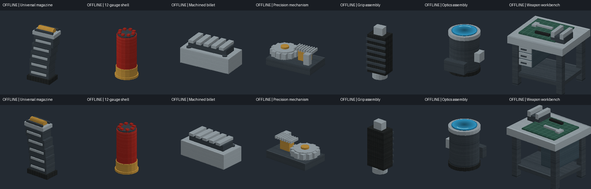

# 0.28.0 手机射击、战斗反馈与换弹修复

## 实现

- 手机触屏枪械使用相机中央准星射线；电脑鼠标及手机键鼠保留输入射线。射击方向先确定，再应用后坐力。普通枪械保持原有 64 米射程、散布与遮挡判定，电击枪保持 3.05 米。
- 实际掉血后准星四个斜角亮白，致死时亮红。击杀显示动物本地化名称、当时使用的武器及射手眼睛到命中点的米数；最多保留三条，3.2 秒内淡出。枪械和刀具共用实际伤害结果，尸体、无伤害和回血均不触发。
- 击杀播放 BF1 原始 `Sound/UI/UI_KillMessage_Wave`，完整 2.521 秒，转换为 Ogg；同一玩家极短时间内的多目标击杀合并音效，避免叠音。屏幕文字按视口缩放并限制宽度。
- 整匣枪在动画结束时原子执行“扣除备用弹匣（MAG-7 为 5 颗霰弹）+ 替换旧弹量”。动画中的退匣只是视觉事件；切物品、打开菜单、中断、弹药不足、保存再进入不会吞备用弹匣，旧余弹保留到成功换弹。管式霰弹仍逐发装填、逐发扣除；电击枪仍自动充能 10 秒。
- 共用补给材质改为显式不透明 RGBA，256×128 及全部 RGB 像素不变。物品栏使用单独的立体网格副本，保留面阴影并独立于场景光照；手持与放置模型继续参与世界光照。

## 物品发黑的验证边界

用户截图中共用材质物品呈纯黑轮廓。离线检查中旧网格顶点与 PNG 的 RGB 数据正常，尚未复现用户设备上的完整故障；因此不能把 RGBA 或光照中的某一项宣称为已证实的唯一根因。这版作了上述兼容处理，并验证游戏实际 DrawMeshBlock 批次在场景光照为零时仍输出正确的物品栏颜色。需要实际设备确认最终显示。

## 打包验收

最终记录写入 `combat-0280-full-check.json`、`combat-0280-lite-check.json` 和 `combat-0280-editions.json`。检查直接加载包内 DLL，包括真实 SCAPI 的物体射线、创造/生存背包、换弹时序与存档、击杀判定、绘制批次颜色和材质像素。离线预览不等于游戏截图。

完整与轻量版共用 DLL、物品索引、玩法和存档格式。完整版保留原贴图；轻量版仍仅将 177 张 1024×1024 贴图派生为 512×512，并保持既有装饰粒子缩减规则。

## 实机复查步骤

1. 手机分别用步枪、狙击枪、霰弹枪，在 10–60 米对准动物射击；白色命中、红色击杀，打墙或尸体不报击杀。检查准星、倍镜、武器名称、动物名称和距离。
2. 生存模式准备两个弹匣和半匣子弹，开始换弹，分别在退匣、插匣和拉栓阶段切刀：备用与旧弹不变；完整换弹只扣一次并丢弃旧余弹。创造模式空枪应可完成换弹。
3. 检查管式霰弹中断保留已装入的每颗子弹；MAG-7 成功结束扣五颗，电击枪仍十秒自动恢复。
4. 在明暗场景查看弹匣、霰弹、四种组件、装配台的物品栏与手持颜色；放置装配台检查世界光照。
5. 打开物品栏、死亡、重进世界后不残留击杀界面。分别检查完整与轻量版，二选一安装，切勿同时安装。

## 最终交付记录

- Full: `ScCsgoKnives-0.28.0.scmod`，219,979,828 字节（220.0 MB），6053 项通过、0 失败；SHA-256 `569818996f04c61fd74545adedebf4762c1b8b1ce3253052d1fbd224d5f24062`。
- Lite: `ScCsgoKnives-0.28.0-Lite.scmod`，111,639,388 字节（111.6 MB），6053 项通过、0 失败；SHA-256 `4faec31946a01d8aaa36a2c71e77a61686632ec3352130590e32b6a6b0b7a02b`。
- 共同 DLL SHA-256：`eb18b121092a65cc98b25b0180c6cbc4ea091b95c79193c1325f0bbcbdb2e459`。
- Full/Lite 与 0.27.0 原画质基线比较：1756 项通过、0 失败；唯一旧贴图编码变化是补给材质 RGB → RGBA，解码后像素逐字节相同。
- 电脑 Mods 已更新为完整版；旧包备份：`E:\Obsidian Document\Document1\ScCsgoKnives\output\installed-backups\0280-20260906-163317\ScCsgoKnives-0.27.0.scmod`。未关闭或重启正在运行的游戏，重启后才会加载新 DLL。
- 构建成功；仅有既有 SCAPI 依赖 NCalc 的两条 NuGet 警告，没有新增编译警告。
- 离线 GPU 绘制检查使用包内网格和材质，结果如下；这不是手机或游戏实拍。

