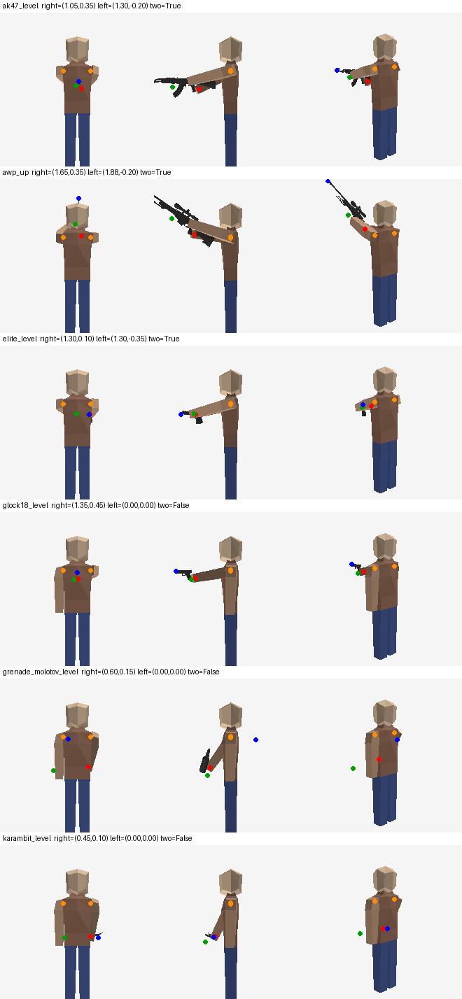

# 0.33.0 社区反馈 M3（第一轮）：第三人称真实尺寸持枪、原版手臂握持、投掷从手出发

日期：2026-09-07。对应规划 F08（完整模型）、F11 的握持部分、F09 的出手点。第三人称的**动作**（开火后坐、换弹、检视的枪体部件运动与手臂曲线）留到下一轮。

## 做法

- 原版 `ComponentHumanModel.DrawExtras` 把手持物按 `InHandScale 0.22` 缩进一个单位盒画在右手骨上，所以之前第三人称的枪是个小方块。
  现在用 `OnModelDrawExtra` 钩子跳过它，改画 `ScThirdPersonWeapon` 烘焙的**真实尺寸**网格：CS2 刚性部件（或 AK/M4A1-S/AWP 的 OBJ 部件、刀/投掷物的蒙皮网格）
  在 idle 第 0 帧的姿态，以武器根骨为原点、英寸转米、Source 轴转引擎轴（朝前 −Z）。第三人称不画 CS2 手臂/手套。
- 握持锚点来自 CS2 视图模型骨架自带的 `wpnHand_R` / `wpnHand_L`（武器坐标系下两只手的位置）；双持手枪用 `weapon_r` / `weapon_l`。
- 手臂：`OnModelAnimate` 钩子里先让原版 `AnimateCreature()` 跑完，再改写两只手骨的角度（原版只有一节手臂：X 抬臂、Y 内摆）。
  右臂按枪类姿态抬起并跟随视角俯仰；武器以右拳为握点、朝准星方向摆正；双手武器再解一次单关节 IK 让左臂指向 `wpnHand_L`。
  姿态表（估计，`ScThirdPersonStance`）：步枪/冲锋枪/霰弹/狙/机枪 右臂 1.05 rad + 左手前握把；手枪/电击枪 1.35 rad 单手；双持 1.30 rad 双臂；刀 0.45 rad 垂手；投掷物 0.6 rad。
- 投掷（F09 部分）：准星射线定目标，弹体从第三人称姿态的右拳出发（第一人称时仍是眼前 0.45 m），身体到手、手到飞行方向都做近墙回退，再朝目标解算方向。
- 第一/第三人称读同一份物品值；模型没被绘制的帧不改姿态。多个摄像机同一帧共用一次姿态计算。

## 离线验证

`PackageCheck --third-person-out DIR` 用 Content.zip 的 HumanMale 和包内 DLL 自己的姿态代码导出世界三角形，`tools/third_person_render.py` 光栅化：

（红点右拳，绿点左手目标，蓝点枪口；三列为正面/左侧/斜后。）自检新增 `third-person-arm-maths`（闭式反解与引擎矩阵往返）、`third-person-stances`、10 件武器的尺寸/锚点/枪口朝向检查。
PackageCheck 6144/6144，运行时自检 5873/5873；包 `output/ScCsgoKnives-0.33.0-Lite.scmod`，SHA-256 `ecd416d142846104c29e403cce535e33b10b4756b75c390e9cc9d24db7582074`。

## 实机要看

第三人称（默认按键切视角）拿 AK/AWP/手枪/双枪/刀/雷：枪在右手、真实大小、朝准星方向；抬头低头枪随之抬落（若反了改 `ScThirdPerson.PitchSign`）；
左手是否伸到前握把；蹲下、跑动、跳跃时手臂是否穿模；别的玩家看你也一样。投雷时弹体从手边出发而不是从镜头。
Game.log 每种武器第一次会记 `third person ak47: … grips … right arm … fist …`。

## 下一轮

开火/换弹/检视时枪体部件（弹匣、枪机）按 CS2 片段运动并与第一人称同一事件时间；按枪类手工手臂曲线；投掷拔销/出手姿态；多人同屏与缓存预算。
