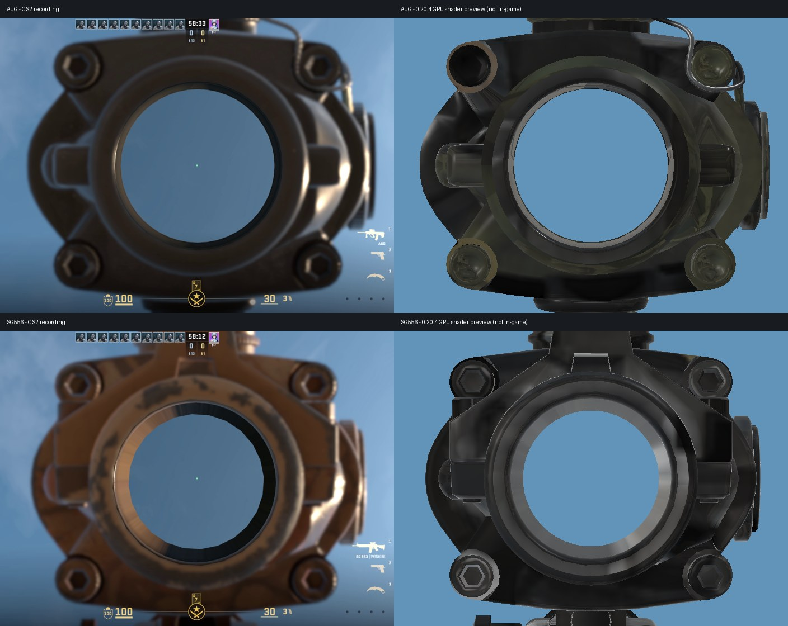

# 0.20.4：统一 CS2 真实手、10 秒电击枪与录屏开镜校准

日期：2026-09-06。

## 修改前备份

当前 Windows 版本先提交为 `b12891d`，已推送 `backup/windows-0.20.3-20260906`。随后获取远端，确认 `origin/main` 的 `b21d8d7` 也是 0.20.3；两者内容仅 LICENSE 行尾不同，代码和资源相同。保留原 `output/ScCsgoKnives-0.20.3.scmod`。

## 方块手的原因和修复

内置 `KnifeProfile`、`GunProfile` 默认值均为 0，实际游戏目录的 `ScCsgoKnivesTuning.txt` 也均为 0。第一批 22 把刀和 AK-47 / M4A1-S / AWP 有 CS:MC 后备路径，因而回到方块手；后续 32 把枪标为 CS2Only，不受同一开关影响。

57 个武器变体现在全部标记 CS2Only。两个旧开关和 Cs2Arms 作为兼容属性固定返回 1，旧配置赋值不能重新关闭真实手。第一人称 Draw 直接进入 CS2 绘制；刀的掉落物／物品模型改为 CS2 蒙皮姿态，前三把枪的物品模型改用已有 CS2 OBJ。变体顺序、存档物品编号没有变化。调参文件只再输出当前可用的显示选项，历史方块手参数不再展示。

保留了部分历史 C# 诊断工具与离线算法，以免破坏历史证据工具；运行入口不再调用方块手绘制，相关网格和动画已不在发布包中。AGENTS.md 记录了以后只做 CS2 真实手的要求。

## 电击枪

GunSpec 的充能时间由 30 改为 10 秒。现有源码未发现 100 秒配置，因此不能断言用户看到 100 秒的具体起因已经复现。

开枪时设置绝对游戏时间截止点，切枪继续按原截止点计时；世界保存逻辑保留。载入旧存档时会将过长／跨版本异常的未来截止点截到当前时间 + 10 秒，已经到期的仍然到期；无效数值重置。已消费的载入记录从暂存表移除，避免残留旧记录。

## AUG / SG553

录屏实际位于 `SC_VIDEO`，两段均为 1408×1056：

- `反恐精英：全球攻势 2026-09-05 23-33-30.mp4`，SHA-256 `aa85b024e56681a86fef55164b3818956d87b7ea6926f4d16c38e83f501d0b31`
- `反恐精英：全球攻势 2026-09-05 23-33-52.mp4`，SHA-256 `ac716e6a05ef1701983ce4b1405cf3e796b1ef25e9c90688fbbd0b1d28f7a82c`

取 AUG 6.8 秒、SG553 6.5 秒的稳定开镜帧作对照。录屏里有四角螺丝的真实镜筒，镜筒外仍可见场景，中心为绿色光点。0.20.3 的隐藏整枪 + 全屏黑色 scope_filter 与此不符。

新版保留现有 CS2 body_hd 模型，不导入旧 CS:MC 模型。腰射投影仍为用户原有 CS2 viewmodel 参数；瞄准时取消腰射偏移，使用单独校准的窄模型投影。**世界仍为 45 度的 2× 放大，9 度仅是模型显示参数**，用于保持镜筒在录屏里的透视比例。把相机直接推进镜筒会夸大近端圆环、挡住四角外壳，离屏对照已排除此摆放方式。

着色器只在 AUG/SG553 瞄准时透出中心光学口径（直径分别为屏高 0.52 / 0.46），保留镜筒和外围场景；每次普通绘制清零该参数，避免影响其它武器或手臂。HUD 仅画绿色光点。镜片原有开镜透明逻辑继续保留，开镜射击仍使用 ironsightShoot 片段。

右栏是实际新版着色器在 NVIDIA 显卡上的离屏绘制，使用现有模型、贴图、动画姿态；不是生存战争实机截图，也未模拟 CS2 的景深模糊、相同天空光照和 SG553 的猎物印花皮肤。开镜时的最终动画过渡、连续射击和整套 UI 尚需游戏内确认，不能据离屏图宣称像素级还原。

## 资源清理与包体

清理 158 个文件、59.99 MB 源文件：25 个 CS:MC 动画，以及退休的 OBJ、基础色／法线／ORM 和旧狙击镜贴图。逐项清单：`cs2-0.20.4-removed-assets.json`，含路径、字节数和 SHA-256。

保留全部 CS2 原始导出、CS2 真实手及武器资产、槽位图标、仍在引用的共享音频、枪口效果与 PBR 环境/LUT；其它项目及 VPS 文件没有被删除。打包工具按当前源文件清单取文件，避免增量构建目录残留旧资产。

安装包 `output/ScCsgoKnives-0.20.4.scmod`：

- 626 项，203,694,385 字节（203.7 MB）。
- 原包 229,500,707 字节（229.5 MB），减少 25.8 MB，约 11.2%。
- SHA-256：`9bd0c99e7be6bb5236066c9866197e355dcd1bf5795984e529b183c2909377ec`。

## 验证

- Release 构建：成功，0 编译错误；仅既有 NuGet NCalc 依赖告警。
- **安装包内 DLL** 自检：2629 / 2629 PASS（`cs2-0.20.4/package-selftest.json`）。含 57 把武器的 CS2 路由与真实手绑定、22 把刀的物品模型、旧配置不回退、10 秒冷却值、4:3 / 16:9 / 21:9 光学口径与投影检查，以及原有动画、声音、枪械和特效检查。
- 包内 621 个资产与源目录清单和字节内容完全一致；158 个退休文件没有回流；57 把武器的模型、贴图及图标引用完整，ZIP CRC 通过（`cs2-0.20.4/package-assets.json`）。
- GLSL ES 着色器经引擎相同的宏前处理，在 NVIDIA GeForce RTX 3060 Laptop GPU 上编译、链接并完成 AUG/SG553 离屏绘制。
- 本轮未操控游戏实机，也未覆盖现有 Mods 安装目录。建议安装新版后抽查 AK、M4A1-S、AWP、蝴蝶刀和其余刀的手，电击枪打空切枪等待 10 秒／存档重进，以及 AUG/SG553 连续开镜射击。
