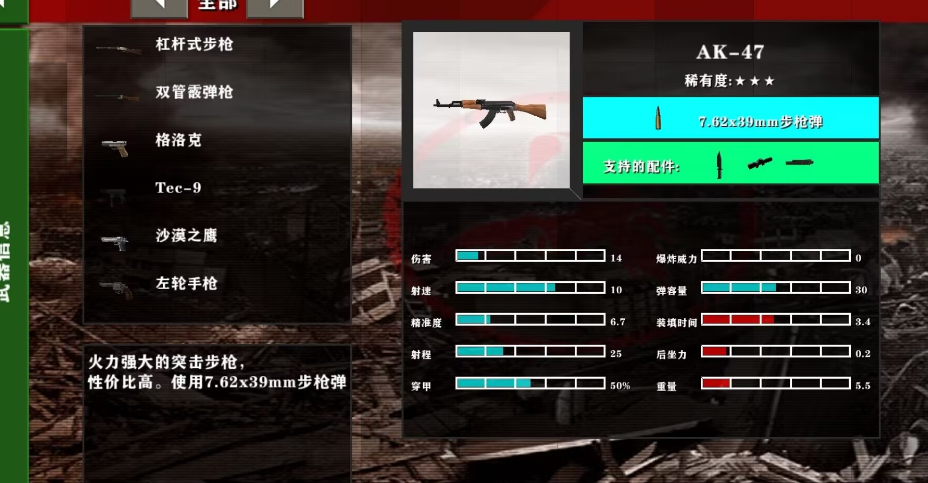

# 枪械计数器与成长、属性界面、手机触控规划

日期：2026-09-08。实现基线：0.38.6（`059ad12`）。状态：**用户已授权按本文与35枪审计开始实施；P1a进入测试包阶段，其余阶段尚未完成**。进度与边界见 [P1a实施记录](gun-handling-p1a-0390.md)。

最新规划修订：按用户后续反馈，将未实现的成长改为十级、每级100次有效击杀、累计1000次满级的用户确认曲线，满级普通子弹枪在连续已加载区域内不限武器射程、零散布、无后坐力；容量／耐久／充能奖励提高。补齐手机版模组设置、击杀播报和枪械准星控制。当前代码已到0.39.1诊断版，**本轮只更新文档，不表示成长或设置UI已经上线**；历史测试结果不作为新增功能的验收。

本文整合用户意见与上一轮建议。原文规划阶段仅授权设计，随后用户明确要求“按照这两份文件开始做”；现授权范围为本文阶段顺序和审计初值，不扩展到其他被阻塞的历史里程碑。后文“尚未实施／不改代码”等原规划描述以本节进度和独立实施记录为准，不作为已经完成全部功能的声明。计数器、成长和手机端效果仍须各自验证，不能以P1a通过代替。

## 1. 用户要求与本次修订

| 项目 | 本文采用的要求 |
|---|---|
| 属性界面 | 参考用户提供的“左侧武器列表、上方武器预览与信息、下方分段属性条”布局，重视手机可读性 |
| 属性界面排除项 | 物品帮助／配方入口的属性页、装配台属性详情不显示当前耐久／最大耐久，不显示制作原材料 |
| 手机按钮 | 独立实现位置、大小、半透明与透明度设置，不再参考、查找、下载或依赖玲兰触控 |
| 手机模组设置 | 提供手机可直接操作的模组设置界面；自定义按键总开关、逐键开关、大小、位置、透明度均可设置，不要求编辑JSON |
| 击杀播报 | 增加可持久化的播报开关，不影响真正的击杀计数、成长或伤害结算 |
| 枪械准星 | 仅持枪时显示；支持原版样式及颜色设置，切空手／刀具／投掷物后不残留枪械准星 |
| 计数器范围 | 首期仅枪械；不为刀具、手雷、音乐盒等建立计数器成长系统 |
| 计数器资源 | 优先复用 CS2 已有的完整 StatTrak 枪械外观配置和组合关系，不自行设计模块或目测安装位置 |
| 成长属性 | **包含伤害、射程、弹匣容量、最大耐久、充能速度提升**，取代上一版“暂不增加”的建议 |
| 成长修订 | 十级，每级新增100击杀、累计1000满级；伤害最多+50%、容量建议最多+50%、耐久最多+50%、电击枪10秒→5秒；普通子弹枪满级提供娱乐向激光手感 |
| 电击枪专项修订 | 用户要求比54／81方案更大幅加强，并提高制作难度；当前建议基础150、满级225，制作等级6、更多组件及钻石，不增加无限耐久／连续充能 |
| 新增基础手感反馈 | 用户反馈近乎无散布、狙击不开镜也很准、射程过远；先核对并校准CS2来源参数，再应用成长，不将当前失真的基础值直接强化 |
| 存档 | 给原枪添加能力，不删枪重造，不清空原弹量、涂装、耐久或充能 |
| 本轮交付 | 一份可供后续开发与验收使用的规划文档，而不是功能安装包 |

这里“不显示耐久、制作原材料”约束的是属性卡。保留现有战斗耐久提示、专门维修界面的必要状态；实际组装、安装计数器的确认窗口仍须告知将扣除的组件，不能隐藏交易成本。不要将基础原料展开清单塞回属性卡。

## 2. 已核查的现状

- 当前35种枪型；物品布局v5只携带型号与世界内实例引用，注册表schema 2保存弹量、耐久、最大耐久、修订号、充能、涂装等。
- 现有击杀提示是短时玩家反馈，不是每把枪的永久计数。不能从HUD显示列表反推历史击杀数。
- 当前手机功能按钮在 `ConfigureButton` 中反复使用固定104×60尺寸和固定边距；只增加滑块而不替换这条布局逻辑，设置会被下一帧覆盖。
- `ScAssemblyRecipesScreen` 当前主要展示材料，不是参考图中的属性浏览页，需要单独设计新布局和切换关系。
- 当前枪械命中威力以 `ScSurvivalBalance` 为准，不应直接显示 `GunSpec.AttackPower` 或CS2导出表的参考伤害。散布／后坐力还要尊重当前 `GunNumbers` 模式。
- 当前加载校验及事务中有多处 `Rounds <= GunSpec.Magazine`、按枪型查询耐久上限的逻辑；容量／耐久成长不是仅给属性页加百分比，必须统一改为按具体枪械状态求有效数值。

### 2.1 新增：基础散布与射程核对

用户在本文撰写中追加该问题，此处是诊断证据及规划补充，不是授权立即改动武器手感。

本机当前 `GunNumbers=0`。CS2导出文件 `01_weapon_data/firearm_blocks/weapon_awp.vdata` 含有：

```text
m_flSpread = [0.0002, 0.0002]
m_flInaccuracyStand = [0.0808, 0.002]
m_flInaccuracyCrouch = [0.0606, 0.0015]
m_flInaccuracyMove = [0.17648, 0.17648]
m_flInaccuracyJump = [0.13383, 0.13383]
m_flInaccuracyFire = [0.05385, 0.05385]
m_flRange = 8192
m_flRangeModifier = 0.99
```

数组的主／副模式需逐枪解释：AWP是不开镜／开镜，M4A1-S是无消音／消音，不能统一称成开镜。其他蹲下、移动、跳跃、落地和射击恢复参数也有来源，不是完全需要凭感觉猜。

| 枪械 | 当前默认不开镜散布半角 | CS2数据换算的站立不开镜半角 | CS2数据换算的站立开镜半角 |
|---|---:|---:|---:|
| AWP | 0.1° | 4.63085° | 0.12605° |
| SSG 08 | 1.8317° | 1.83169° | 0.18506° |
| SCAR-20 | 1.4951° | 1.49508° | 0.13178° |
| G3SG1 | 1.4951° | 1.49508° | 0.13178° |

这些角度是现有导出脚本用 `atan(Spread + Inaccuracy)` 得出的单锥近似，不是原始字段的单位，也不是完整CS2随机弹道分布。当前AWP确实明显过准，但不能笼统说每把狙击的默认散布都是0；其余枪也要检查状态、不精度累积和命中容差。

30格距离处，0.1°锥的理论最大偏离半径约0.052格，4.63085°约2.43格。现有身体射线还有0.35的容差参数，细分头部模型未命中时存在普通身体命中回退；应验证它是否掩盖了实际偏离。先用无生物墙面弹点测试，再用目标命中率测试，不能只看准星或枪口动画判断散布。

当前 `Cs2Weapons.SpreadDegrees` 只做站立／移动的线性插值，未完整实现蹲下、跳跃、落地、连续射击增加不精度和时间恢复状态；`GunNumbers=1` 也不是“一键完整CS2”。相机后坐力与子弹散布独立，不应靠加大镜头抖动掩盖子弹过准。

**射程分为三个概念：**

1. 最大射线／追踪距离：CS2资源中的 `m_flRange`。上述狙击及AK、M4均为8192单位，按项目当前每单位0.0254格的约定约208.0768格；直接导入反而比当前64格更远。这是项目单位映射，不是必须采用的生存玩法距离。
2. 伤害有效距离：`m_flRangeModifier`和实际使用的衰减公式。当前生存分段衰减不是CS2的逐距离公式；若移植CS2衰减，应只提取倍率曲线乘生存基础威力，不顺手把15攻击力换成参考Damage36。
3. 命中有效距离：散布、瞄准状态、目标大小共同决定，不应在UI给出一个没有说明条件的伪精确“有效射程”。

**P0新增前置任务：**核对继承默认与主副模式，保留原始无量纲不精度数据，建立状态化散布；以CS2参数作为相对关系依据，标明未移植的引擎算法。本轮已给出第2.2节逐枪具体初值和第2.3节执行公式，不再只写“以后再定”。这些值是可进入测试的建议版，仍需基准弹点、目标距离与手机操作测试后验收，本轮不改默认配置。

伤害、散布／后坐力、最大射程、衰减需要可分别核对的策略，不继续依赖历史含义混杂的单一GunNumbers开关。既有用户配置升级要明确映射，不以UI重构顺带改手感。

本节通过后，才以冻结的基础值作为成长表的P0/R0等。第5.4节已按本轮逐枪射程建议同步示例，不能把旧版统一64格重新作为所有枪的成长基础。

### 2.2 全35枪逐项对照与轻量手感建议（本轮新增）

本表来自35份本机CS2枪械数据及继承默认，均核对容量、射击间隔、主副模式、原始散布／不精度、恢复、后坐力、射程和衰减。当前包内站立散布换算与重新读取原始文件一致。不是只检查狙击或按大类猜全部枪。原始参数、文件哈希、每模式建议值及覆盖检查保存在 [35枪来源审计](gun-handling-35-source-audit-2026-09-08.json)。该文件仅用于设计审计，游戏不加载它。重建命令：`python tools/audit_cs2_handling_plan.py`。

数学检查覆盖35枪的两组资源模式，验证有限值、站立／移动／蹲姿边界及射程；每组1000个简化圆锥样本只用于排除单位和边界错误，不是实机命中率验收，不为未开放的副模式增加功能。

**方案状态：待实施、待实机校准的明确初值。当前0.38.6没有改变。** 原始CS2列只是来源，不是已经实装的完整弹道算法。伤害、基础射速、容量、耐久、弹药成本继续保留现行生存平衡；本节调整基础手感和距离定位。

#### A. 原始资源与当前默认对照

下表都是主模式、站立首发。无量纲原始量已由同一公式换算为角度，移动列是资源移动不精度加基础spread的比较端点，不直接当作新版游戏惩罚。

| 枪械 | 当前散布° | CS2站立换算° | CS2移动换算° | CS2 Range单位 | 项目换算格 | CS2衰减参数 |
|---|---:|---:|---:|---:|---:|---:|
| AK-47 | 0.3500 | 0.40 | 9.96 | 8192 | 208.08 | 0.98 |
| M4A1 消音型 | 0.3000 | 0.32 | 5.34 | 8192 | 208.08 | 0.94 |
| AWP | 0.1000 | 4.63 | 10.02 | 8192 | 208.08 | 0.99 |
| 沙漠之鹰 | 0.3552 | 0.36 | 2.87 | 4096 | 104.04 | 0.85 |
| 格洛克 18 | 0.4354 | 0.44 | 0.69 | 4096 | 104.04 | 0.85 |
| USP 消音型 | 0.4240 | 0.42 | 0.94 | 4096 | 104.04 | 0.91 |
| M4A4 | 0.3151 | 0.32 | 7.88 | 8192 | 208.08 | 0.97 |
| 法玛斯 | 0.4692 | 0.47 | 5.71 | 8192 | 208.08 | 0.96 |
| MP9 | 0.5500 | 0.55 | 1.70 | 3600 | 91.44 | 0.87 |
| P90 | 0.8393 | 0.84 | 1.83 | 3700 | 93.98 | 0.86 |
| SSG 08 | 1.8317 | 1.83 | 7.05 | 8192 | 208.08 | 0.98 |
| FN57 | 0.6360 | 0.64 | 2.41 | 4096 | 104.04 | 0.81 |
| P2000 | 0.3953 | 0.40 | 0.86 | 4096 | 104.04 | 0.91 |
| P250 | 0.6360 | 0.64 | 1.26 | 4096 | 104.04 | 0.9 |
| Tec-9 | 0.3953 | 0.40 | 0.33 | 4096 | 104.04 | 0.79 |
| CZ75 自动 | 0.7694 | 0.77 | 0.94 | 4096 | 104.04 | 0.85 |
| MAC-10 | 0.7964 | 0.80 | 0.84 | 3600 | 91.44 | 0.8 |
| MP7 | 0.6073 | 0.61 | 1.17 | 3600 | 91.44 | 0.87 |
| UMP-45 | 0.8267 | 0.83 | 1.70 | 3700 | 93.98 | 0.75 |
| PP-野牛 | 0.8594 | 0.86 | 1.64 | 3600 | 91.44 | 0.8 |
| MP5-SD | 0.6073 | 0.61 | 1.75 | 3600 | 91.44 | 0.87 |
| 加利尔 AR | 0.5369 | 0.54 | 7.08 | 8192 | 208.08 | 0.98 |
| SCAR-20 | 1.4951 | 1.50 | 8.57 | 8192 | 208.08 | 0.98 |
| G3SG1 | 1.4951 | 1.50 | 8.57 | 8192 | 208.08 | 0.98 |
| AUG | 0.3094 | 0.31 | 7.74 | 8192 | 208.08 | 0.98 |
| SG 553 | 0.3673 | 0.37 | 7.78 | 8192 | 208.08 | 0.98 |
| 新星 | 2.6909 | 2.69 | 4.39 | 3000 | 76.20 | 0.7 |
| XM1014 | 2.5766 | 2.58 | 4.23 | 3000 | 76.20 | 0.7 |
| 短管霰弹枪 | 3.9472 | 3.95 | 4.51 | 1400 | 35.56 | 0.45 |
| MAG-7 | 2.6909 | 2.69 | 3.20 | 1400 | 35.56 | 0.45 |
| M249 | 0.5557 | 0.56 | 8.99 | 8192 | 208.08 | 0.97 |
| 内格夫 | 0.6973 | 0.70 | 9.15 | 8192 | 208.08 | 0.97 |
| R8 左轮 | 0.1444 | 0.14 | 0.40 | 4096 | 104.04 | 0.94 |
| 双持贝瑞塔 | 0.5157 | 0.52 | 1.14 | 4096 | 104.04 | 0.79 |
| 电击枪 | 0.0000 | 0.00 | 0.00 | 120 | 3.05 | 0.99 |

#### B. 建议采用值：每一把枪，不用区间代替

静止／移动均指不开镜主模式、没有跳跃和连射累积。移动端点为水平速度≥4.5格/秒，不是任意轻推摇杆即吃满惩罚。副模式列只列真实支持的模式，普通枪资源的第二项不自动生成一个瞄准功能。表中角度保留两位作为设计值。

| 枪械 | 静止首发° | 满移动首发° | 支持副模式静止° | 最大射程格 | 满伤害至格 | 射程末端倍率 |
|---|---:|---:|---|---:|---:|---:|
| AK-47 | 0.34 | 1.44 | 不适用 | 48 | 18 | 70% |
| M4A1 消音型 | 0.27 | 0.87 | 消音 0.26 | 48 | 18 | 70% |
| AWP | 3.01 | 3.66 | 开镜 0.11 | 64 | 36 | 85% |
| 沙漠之鹰 | 0.30 | 0.60 | 不适用 | 36 | 12 | 65% |
| 格洛克 18 | 0.37 | 0.40 | 三连发 1.00 | 28 | 8 | 60% |
| USP 消音型 | 0.36 | 0.42 | 消音 0.31 | 28 | 8 | 60% |
| M4A4 | 0.27 | 1.18 | 不适用 | 48 | 18 | 70% |
| 法玛斯 | 0.40 | 1.03 | 三连发 0.25 | 48 | 18 | 70% |
| MP9 | 0.47 | 0.61 | 不适用 | 32 | 10 | 50% |
| P90 | 0.71 | 0.83 | 不适用 | 32 | 10 | 50% |
| SSG 08 | 1.47 | 2.10 | 开镜 0.16 | 64 | 36 | 85% |
| FN57 | 0.54 | 0.75 | 不适用 | 28 | 8 | 60% |
| P2000 | 0.34 | 0.40 | 不适用 | 28 | 8 | 60% |
| P250 | 0.54 | 0.61 | 不适用 | 28 | 8 | 60% |
| Tec-9 | 0.34 | 0.34 | 不适用 | 28 | 8 | 60% |
| CZ75 自动 | 0.65 | 0.67 | 不适用 | 28 | 8 | 60% |
| MAC-10 | 0.68 | 0.68 | 不适用 | 32 | 10 | 50% |
| MP7 | 0.52 | 0.59 | 不适用 | 32 | 10 | 50% |
| UMP-45 | 0.70 | 0.81 | 不适用 | 32 | 10 | 50% |
| PP-野牛 | 0.73 | 0.82 | 不适用 | 32 | 10 | 50% |
| MP5-SD | 0.52 | 0.66 | 不适用 | 32 | 10 | 50% |
| 加利尔 AR | 0.46 | 1.24 | 不适用 | 48 | 18 | 70% |
| SCAR-20 | 1.20 | 2.05 | 开镜 0.11 | 64 | 30 | 80% |
| G3SG1 | 1.20 | 2.05 | 开镜 0.11 | 64 | 30 | 80% |
| AUG | 0.26 | 1.15 | 开镜 0.19 | 56 | 20 | 75% |
| SG 553 | 0.31 | 1.20 | 开镜 0.20 | 56 | 20 | 75% |
| 新星 | 2.42 | 2.62 | 不适用 | 24 | 6 | 15% |
| XM1014 | 2.32 | 2.52 | 不适用 | 22 | 5 | 15% |
| 短管霰弹枪 | 3.55 | 3.62 | 不适用 | 18 | 4 | 15% |
| MAG-7 | 2.42 | 2.48 | 不适用 | 20 | 5 | 15% |
| M249 | 0.47 | 1.48 | 不适用 | 56 | 18 | 65% |
| 内格夫 | 0.59 | 1.60 | 不适用 | 56 | 18 | 65% |
| R8 左轮 | 0.18 | 0.21 | 扇射 3.89 | 36 | 12 | 65% |
| 双持贝瑞塔 | 0.44 | 0.51 | 不适用 | 28 | 8 | 60% |
| 电击枪 | 0.00 | 0.00 | 不适用 | 3.05 | 3.05 | 100% |

#### C. 连射与后坐力的具体初值

每次成功开火之后增加散布，第一发不预扣惩罚；霰弹按一次扳机算一次、三连发按三次算。下表是主模式，副模式完整值见审计JSON。恢复时间指超过停火等待0.12秒后，从累积上限回到0的时间；少量累积恢复更快。镜头恢复T90是偏移衰减90%的用时，与散布恢复分开。

| 枪械 | 每发新增散布° | 连射额外上限° | 满累积恢复秒 | 上跳基准° | 横摆±° | 镜头恢复T90秒 |
|---|---:|---:|---:|---:|---:|---:|
| AK-47 | 0.05 | 1.30 | 0.24 | 1.12 | 0.32 | 0.22 |
| M4A1 消音型 | 0.08 | 1.30 | 0.22 | 0.93 | 0.25 | 0.20 |
| AWP | 0.35 | 0.60 | 0.22 | 2.80 | 0.25 | 0.21 |
| 沙漠之鹰 | 0.40 | 1.60 | 0.35 | 1.80 | 0.45 | 0.40 |
| 格洛克 18 | 0.20 | 1.20 | 0.13 | 0.67 | 0.06 | 0.12 |
| USP 消音型 | 0.20 | 1.20 | 0.23 | 1.08 | 0.00 | 0.21 |
| M4A4 | 0.05 | 1.30 | 0.22 | 0.86 | 0.25 | 0.20 |
| 法玛斯 | 0.04 | 1.30 | 0.16 | 0.75 | 0.19 | 0.15 |
| MP9 | 0.03 | 0.65 | 0.17 | 0.78 | 0.22 | 0.15 |
| P90 | 0.03 | 0.65 | 0.24 | 0.60 | 0.17 | 0.22 |
| SSG 08 | 0.16 | 0.60 | 0.10 | 1.23 | 0.11 | 0.12 |
| FN57 | 0.17 | 1.20 | 0.13 | 0.93 | 0.02 | 0.12 |
| P2000 | 0.20 | 1.20 | 0.23 | 0.97 | 0.00 | 0.21 |
| P250 | 0.20 | 1.20 | 0.22 | 0.97 | 0.04 | 0.21 |
| Tec-9 | 0.20 | 1.20 | 0.25 | 0.86 | 0.21 | 0.23 |
| CZ75 自动 | 0.20 | 1.20 | 0.16 | 1.16 | 0.50 | 0.15 |
| MAC-10 | 0.03 | 0.65 | 0.26 | 0.67 | 0.19 | 0.24 |
| MP7 | 0.03 | 0.65 | 0.28 | 0.60 | 0.17 | 0.26 |
| UMP-45 | 0.03 | 0.65 | 0.23 | 0.86 | 0.15 | 0.21 |
| PP-野牛 | 0.03 | 0.65 | 0.22 | 0.67 | 0.19 | 0.20 |
| MP5-SD | 0.03 | 0.65 | 0.28 | 0.60 | 0.17 | 0.26 |
| 加利尔 AR | 0.05 | 1.30 | 0.20 | 0.78 | 0.22 | 0.18 |
| SCAR-20 | 0.13 | 0.90 | 0.35 | 1.16 | 0.15 | 0.33 |
| G3SG1 | 0.13 | 0.90 | 0.35 | 1.12 | 0.14 | 0.33 |
| AUG | 0.05 | 1.30 | 0.28 | 0.90 | 0.22 | 0.26 |
| SG 553 | 0.05 | 1.30 | 0.29 | 1.05 | 0.26 | 0.27 |
| 新星 | 0.07 | 0.40 | 0.30 | 3.00 | 0.46 | 0.28 |
| XM1014 | 0.06 | 0.40 | 0.33 | 2.99 | 0.26 | 0.30 |
| 短管霰弹枪 | 0.07 | 0.40 | 0.30 | 3.00 | 0.46 | 0.28 |
| MAG-7 | 0.08 | 0.40 | 0.26 | 3.00 | 0.53 | 0.24 |
| M249 | 0.03 | 1.60 | 0.35 | 0.93 | 0.20 | 0.40 |
| 内格夫 | 0.18 | 1.60 | 0.20 | 0.75 | 0.00 | 0.18 |
| R8 左轮 | 0.34 | 1.60 | 0.35 | 0.75 | 0.13 | 0.40 |
| 双持贝瑞塔 | 0.08 | 1.20 | 0.34 | 1.01 | 0.09 | 0.31 |
| 电击枪 | 0.00 | 0.00 | 0.00 | 0.00 | 0.00 | 0.00 |

<!-- END GENERATED HANDLING AUDIT -->

### 2.3 “不那么硬核”的执行规则与选择依据

#### 2.3.1 目标与明确不做的事

- 静止点射应可靠，普通手枪／冲锋枪在近距离可边移动边射击；步枪远处优先短点射；狙击不开镜适合应急，不应等同精确开镜。
- 不要求CS竞技式严格急停，不放大跳跃惩罚到几十度，不用明显干扰手机视角的剧烈镜头抖动制造“真实感”。
- 不增加自动锁头、子弹拐弯、按目标方向收拢散布等隐藏辅助；同一状态下键鼠和手机采用同样弹道与判定，移动友好体现在公开的惩罚曲线。
- CS2数据用于枪械相对差异、主副模式和状态关系；本方案角度缩放、上限、射程、分段衰减、恢复曲线是本模组设计，不称为官方CS2参数。
- 基础伤害、爆头倍率、弹匣、射速、弹丸数量、耐久和制作费用本阶段不变。之前用户确认要做的成长仍按第5节另行应用，不能混淆“基础重平衡”和“实例升级”。

#### 2.3.2 首发与移动

1. 定义资源比较角 `A = degrees(atan(基础Spread + 当前模式站立Inaccuracy))`。非狙击普通枪取A×0.85；AWP不开镜取A×0.65；其他狙击不开镜取A×0.80；霰弹取A×0.90。各类设小的首发下限，最后冻结为表中两位小数。
2. 开镜枪真实副模式首发取资源换算×0.85，最低0.10°，因此AWP建议0.11°而非0；不使用统一“不开镜乘0.35”代替真实开镜差异。
3. 模式选择必须修正：Glock／FAMAS三连发选择burst索引，M4A1-S／USP-S按消音状态，R8按蓄力／扇射，六种带镜枪按是否开镜；其他没有实际副模式的枪只使用主模式。资源中的第二项即使数值不同，也不凭空开放功能。MP5-SD用它自身的内置消音资源，不能拿USP的消音规则套上去。
4. 水平移动速度v ≤0.5格/秒无移动惩罚；0.5～4.5格/秒线性增加，≥4.5格/秒达到表中移动端点。不将竖直下落速度当作跑动速度。
5. 额外移动角为 `min(该类上限, max(0, CS2移动比较角−CS2站立比较角)×0.12)`，再乘上述速度比例。开镜额外角上限1.20°。普通手枪上限0.90°、重手枪1.20°、冲锋枪0.45°、步枪1.10°、带镜步枪1.20°、栓狙1.60°、连狙1.30°、霰弹0.50°、机枪1.40°，电击枪不加。
6. 保留轻武器差异：Tec-9原始移动不精度低于站立，本方案不额外惩罚；MAC-10差额换算到两位小数后接近0。这不代表无基础散布或无连射散布。不是为了“每把枪都改”人为增加所有枪相同罚值。
7. 速度端点按本游戏可理解的4.5格/秒选定，不照搬CS2最大移动速度来改变玩家移速；原始MaxSpeed留作来源参考。建议进出瞄准时用0.15秒插值切换角度，不添加不能开枪的强制等待；移动／空中／连射惩罚不会因按下开镜立刻清零。

#### 2.3.3 蹲下、跳跃、落地

- 蹲下首发使用 `站立方案角×clamp(CS2蹲下比较角/CS2站立比较角,0.80,1)`，最多改善20%；开镜也按该模式计算。界面默认显示站立值，展开可显示蹲下值，不把不同姿势混成一个“精度百分比”。
- 空中额外角取 `clamp(max(0,CS2跳跃比较角−CS2站立比较角)×0.25,0.20,该类空中上限)`。普通手枪1.20°、重手枪1.80°、冲锋枪0.90°、步枪／带镜步枪1.50°、栓狙／机枪2.00°、连狙1.80°、霰弹1.00°为上限。电击枪仍0。
- 原始跳跃有JumpInitial、JumpApex、Jump、Land等多字段，不将一个Jump字段冒充完整CS2跳跃曲线。首版明确采用上面的简化额外惩罚，SSG 08较好的跳跃资源关系保留为较小惩罚，但不开镜首发仍不是精确射线。
- 明确起跳或持续离地超过0.10秒才进入空中状态，避免台阶接触抖动持续惩罚。落地后替换为空中额外角的40%，在0.18秒内线性恢复0；空中和落地额外角不重复相加。
- 水中／梯子没有可靠当前适配时，使用明确标记的稳定保守状态，首版沿用该枪满移动惩罚而非猜测CS2姿势；不会因为缺字段变成零散布。此简化必须在设置说明及验收报告中注明。

#### 2.3.4 连射累积、恢复和相机后坐力

散布由首发姿势角、移动额外角、空中或落地额外角、连射累积组成。当前射击先采样、再增加本次开火带来的累积；一发霰弹的所有弹丸读取同一状态快照。等级成长只在最终有效散布上乘一次，不叠加两轮加成。

```text
ShotCone = StanceCone + MoveExtra×MoveFactor + AirOrLandingExtra + Bloom
本次成功开火后：Bloom = min(BloomMax, Bloom + BloomPerShot)
连续0.12秒未开火后：Bloom以 BloomMax / 表中恢复秒 的速度减至0
```

每发增量来自 `degrees(atan(InaccuracyFire))×0.12`，按类限制为0.03°至规定上限；霰弹、电击枪和每模式值详见审计表。停止按住开火不等于立刻清空，停火最多约0.47秒即可从满惩罚恢复，满足非硬核目标。失败开火、空枪点按不增加累积。换弹、切枪不立刻抹掉原枪的残余状态；按原枪和游戏时间继续衰减，避免快速切枪绕过连射惩罚。

相机上跳采用原始RecoilMagnitude相对AK30的比值×1.6°×0.70，并按类封顶；横摆采用同一资源角度方差换算后×0.35。上跳随机量仅为0.9～1.1倍基准，横摆为±表中值，不添加无限镜头翻转。镜头恢复用 `exp(-ln(10)×dt/T90)`，只恢复本模组施加的偏移，不拉回玩家主动瞄准的视角。

CS2的RecoilSeed、连续射击转移阈值和Negev等特殊随机分布保留在来源说明中，首版不声称复刻完整固定弹道。先实现确定、可测试的温和累积；不能看到原始第二项更小就自动推断“射到某发后使用副模式”。

#### 2.3.5 射程与伤害衰减初值

本轮选择比现行更清晰的武器定位，不把实际射线普遍拉到资源换算的约208格。

| 类型／具体武器 | 建议最大射程 | 满伤害距离 | 最大射程处倍率 |
|---|---:|---:|---:|
| 普通手枪（含CZ75、双持） | 28格 | 8格 | 60% |
| 沙鹰、R8 | 36格 | 12格 | 65% |
| 全部冲锋枪 | 32格 | 10格 | 50% |
| AK、两种M4、Galil、FAMAS | 48格 | 18格 | 70% |
| AUG、SG 553 | 56格 | 20格 | 75% |
| AWP、SSG 08 | 64格 | 36格 | 85% |
| SCAR-20、G3SG1 | 64格 | 30格 | 80% |
| M249、Negev | 56格 | 18格 | 65% |
| Nova | 24格 | 6格 | 15% |
| XM1014 | 22格 | 5格 | 15% |
| MAG-7 | 20格 | 5格 | 15% |
| 截短霰弹枪 | 18格 | 4格 | 15% |
| Zeus | 3.05格 | 全射程 | 100% |

非霰弹在满伤害距离到最大射程之间线性衰减，越界不命中。霰弹采用三段节点：满伤害距离100%、该距离与最大射程的中点40%、最大射程15%，分段线性；例如Nova是6格100%、15格40%、24格15%，截短是4格100%、11格40%、18格15%。不是在最大射程外仍以15%无限射击。

这套曲线明确是生存平衡：已经逐把读取原始RangeModifier，但首版不直接套用CS2的指数公式，也不让同类微小差异把UI和调参变得难理解。枪内差异仍由伤害、散布、射速、容量、后坐力和现有配方体现。属性页的“射程”应标明最大距离，展开显示满伤害区间与末端倍率，不笼统承诺在该距离能稳定命中。

伤害衰减和成长计算顺序：`生存近距威力×成长伤害倍率×本方案距离倍率÷弹丸数×部位倍率`。保留原普通伤害／爆头表和电击枪例外，不调用会替换为CS2参考Damage的旧辅助方法。

#### 2.3.6 命中容差不能继续吞掉散布

- 区分“有可用模型且精确检测确定落空”和“模型／头部规则暂不可用”。当前二者都可能成为Unknown后按身体伤害回退，这是需优先检查的共性问题。
- 保留宽松的候选筛选用于性能，但它不能直接决定伤害。对支持的模型先检查实际逻辑姿态的部位范围，确定落空就不扣血，不因为0.35候选容差而自动补成身体命中。
- 最近的粗包围盒候选落空后，继续检查射线后方其他候选，以真实部位交点和墙体距离决定最近有效命中；不能让前景粗包围盒变成一堵无形墙，吞掉后方应命中的目标。
- 首版建议身体最终容差最多0.08格，按目标尺寸限制为身体最小水平尺寸的10%以内；头部不扩张。只有射线实际碰到头部才能爆头，仅碰到身体容差外壳最多普通伤害。
- 模型不可用或其他模组没有头部规则时，用缩小容差的身体包围盒做普通命中回退，并记录“缺少精确模型”的诊断；不借此禁用其他模组生物，也不凭空判头部。
- 不能依赖目标必须已被当前摄像机绘制来决定命中。复用／补齐逻辑姿态更新，未绘制、遮挡、多摄像机情况下结果一致；墙体仍优先，容差不能越过墙体。
- 不新增竞技级每三角形碰撞成本，优先复用现有骨骼部位包围盒，按帧／实体缓存。性能退化时要记录原因，不能静默回到超宽容差。

#### 2.3.7 全枪型验收与落地边界

1. 来源层：35/35原始文件＋继承默认校验，保留文件哈希、数组索引、未用字段和导出时间依据；不要宣称本机既有导出是全球最新CS2版本。
2. 数学层：逐枪检查各姿态、支持副模式、零值、角度单位、0.5／4.5速度边界、恢复时间与帧率无关、射程边界及衰减节点；确定种子检查可复现。
3. 弹点层：每枪每典型状态至少1000发，固定无目标墙面，记录50%／90%弹点半径；随机分布与圆锥上限一致，不把“有散布数值”当作有散布的证明。
4. 命中层：0.6×1.8格人体和小型生物分开，在5、15、30格及该枪近／远端测试，空墙弹点、真实部位、容差外壳、墙后目标分开统计；目标在粗包围盒内但不在部位范围内不能自动中弹。
5. 可玩性目标（待实机验证，不是保证）：近距10格普通手枪／冲锋枪首发可用；20格静止步枪短点射可靠、持续边跑边扫明显更差；30格AWP不开镜不可靠、站稳开镜可靠；霰弹近强远弱，64格外普通枪不再普遍命中。
6. 真机覆盖至少一台低性能Android、一台常规Android，分辨率16:9与20:9，30/60帧；键鼠与多指移动开火同时测。没有设备证据，不宣称“手机手感已验证”。
7. 开关拆分为清晰的实际射击策略，显示当前策略来源。新预设上线前展示一次变化说明；不把玩家的任意旧配置无提示覆写。旧存档物品、弹量、耐久、涂装与充能均保留，安装新预设不修满枪。
8. 本节只形成方案与来源审计。后续实际代码改动须单独授权，先接入基础手感、再更新属性页，最后测试第5节成长。不能只改表面UI或把GunNumbers拨为1就交付。

## 3. CS2 StatTrak 资源复用

### 3.1 已确认的资源

本机CS2 VPK包含以下官方资源：

```text
weapons/models/shared/stattrak/stattrak_module.vmdl_c
weapons/models/shared/stattrak/materials/stattrak_module.vmat_c
weapons/models/shared/stattrak/materials/stattrak_module_display.vmat_c
weapons/models/shared/stattrak/materials/stattrak_digit_atlas_psd_bf07cc9c.vtex_c
```

显示材质有 `F_STATTRAK=1`、`F_SELF_ILLUM=1`；动态参数 `g_nStatTrakValue` 引用 `$ent_stattrak`。其中654321是资源默认预览值，不是游戏里应固定显示的计数。

既有35份枪械模型分析文件检索到 `stattrak` 附件名；AK、M4A1-S、AWP还确认了独立的 `stattrak_legacy` 安装变换。发现附件不等于已经验证了35种枪的完整导出、官方经济系统资格及运行呈现，仍需逐型核对。

### 3.2 实施路线

1. 先核对完整官方计数器枪配置、模块引用、材质、附件变换和可见性条件。若官方提供可直接导出的完整组合，优先整体保留；若由共享模块加官方附件关系组装，则导出该关系。两种情况都不凭空寻找必须存在的“每皮肤一个独立StatTrak GLB”。
2. 保持每个涂装当前已验收的枪体与UV路线。高清枪体选其 `stattrak`，旧版枪体选其 `stattrak_legacy`；禁止仅为装计数器切换整把枪的年代或UV。
3. 将官方单位、旋转、骨骼变换转换到当前CS2渲染链，跟随正确武器骨骼。枪体、模块外壳、数字分别保留材质；数字不能被枪皮涂装或错误AO染色。
4. 数字由本模组的持久化计数驱动，更新时切换官方数字图集采样。不得为了每次计数重新烘焙整张皮肤图，也不得每帧创建纹理。
5. 优先验证AK、M4A1-S、AWP，再扩展其余可确认资源的枪型。官方资格与本模组开放范围分开记录，尤其电击枪等特殊武器；缺少可靠外观组合的枪型先禁用安装并明确说明，不默默显示错位替代品。
6. 第一人称、检视、第三人称、掉落物及属性页保持计数一致。小尺寸栏位图使用可辨识的计数器标记，不强求在128像素图标中塞入实时数字。
7. 内部计数使用非负64位数，溢出做饱和保护。若验证官方显示面板是六位，面板超过999999时封顶显示，属性页仍显示完整值；不让视觉位数反过来截断存档数据。

只复用Valve资源外观，不宣称CS2本身具有本文的生存成长效果。首期不使用已找到的刀具StatTrak资源，不改变刀具物品身份结构。

## 4. 原枪安装、计数与归属

### 4.1 原地安装

装配台提供“安装计数器”，选中背包内具体枪械，在原实例上提交一次事务。

建议首版费用：金属坯件×1＋精密机构×1＋玻璃×1＋锗块×1，玩家制作等级3；相当于铁锭×8、煤×2、铜锭×2、锗块×2、玻璃×1。此为新功能建议费用，不改变原枪制作配方。直接安装，不新增一个必须占用物品编码的“计数器版枪型”。

| 字段或状态 | 首次安装结果 |
|---|---|
| 枪型、现有实例ID | 保持；不销毁旧枪再造同型枪 |
| 弹量、涂装、消音器 | 原样保留 |
| 当前／最大耐久 | 原样保留，不修满；新装等级0无成长增益 |
| 充能中／已充满 | 保留剩余充能与就绪状态，不赠送一次放电 |
| 新增计数器状态 | 已安装；有效击杀0；等级0；不再引入独立成长经验 |
| 新增规则版本 | 写入明确的成长规则版本，不借用模组版本号 |

无实例ID的全新模板只在实际安装时原子分配实例；表满或扣料失败整次回滚。已有枪不换ID，不能升级时批量把所有模板登记进只有1022个可用ID的注册表。

重复安装拒绝且不扣料。首期不开放拆卸、跨枪转移计数或降级重置；允许关闭外观显示，但不卸掉已获得的能力或清空数据。维修、换肤、交给其他玩家、箱子往返、掉落拾取，都保留原实例计数与成长。

### 4.2 计数直接驱动等级

- 本轮改为直接按本枪有效击杀数 `KillCount` 解锁等级，不再新增独立 `GrowthXp`、目标经验权重或每分钟经验上限；取消此前100杀满级口头建议，采用第5节十级门槛。
- 从安装后开始计数，既有版本没有可靠逐枪历史，不从开火数、耐久消耗、HUD或玩家总击杀补算。
- 保存开火时的世界、攻击者、枪械实例、射击事件ID和属性快照；致死回调按凭据归属，不能临时读取 `ActiveBlockValue`。换枪、丢枪、赠送不应让最后一击记到另一把枪。
- 目标从存活到死亡且由该武器伤害造成，才计一次。同一死亡事件去重，多颗霰弹同一目标只算1次。持续伤害、手雷、环境死亡、尸体受击、自杀、友方／驯养目标和助攻不计。
- 联机由权威端确认，客户端只显示；不得接受客户端提交的计数增量。击杀播报、音效、准星和计数器外观的开关都不能控制这个结算入口。
- 计数和待升级状态在同一枪记录事务中提交；临时冲突按原事件凭据重试，不丢计、不重复计。跨保存点的死亡归属和待处理状态与世界快照一致，不能把HUD限频／去重当成持久化正确性的保证。

### 4.3 有效击杀范围与防重复

| 目标或行为 | 生存计数与成长 |
|---|---|
| 正常生存中非友方、非驯养的敌对生物或普通动物 | 每次真实击杀+1，不按强弱另算经验 |
| 合法PvP击杀 | 默认不计；首版不做刷玩家成长，可后续另行设计服务器规则 |
| 创造模式开火、明确创造生成／测试标记目标 | 不进入生存计数；测试走隔离记录 |
| 尸体、无生命组件、自杀、友方／驯养目标、重复死亡事件 | 不计 |
| 普通击杀播报被关闭 | 照常计数，关闭的只是表现 |

根据实际生成／模式元数据识别测试来源，不能只按生物名称猜来源。保留明确的创造／测试标记检查，但不再要求每个正常生存动物必须证明“自然生成”，以免旧档或其他模组缺少元数据就永远无法成长。无法识别被手工编辑或外部作弊生成的目标时如实注明边界，不承诺完美防刷。

不加复杂每分钟限额；主要靠合法伤害归属、死亡事件一次性确认、友方过滤和创造隔离防止重复计数。1000次有效击杀是用户本轮确认的毕业门槛，不要求额外材料或挂机时间。

创造复制作为新复制品，不复制可带回生存的击杀／等级收益。正常转移、迁移、事务失败补偿属于原枪，必须保留计数。复制品取消等级会缩减容量和最大耐久时，仍按第6节守恒与比例规则处理，不直接清空全部枪械状态。

## 5. 十级成长数值设计（本轮修订建议）

本节取代原五级经验方案及后续聊天中的“100杀满级”建议。用户本轮确认10级、每级100击杀、满级伤害+50%、耐久+50%、电击枪10秒→5秒，并保留满级娱乐向毕业效果。容量+50%沿用上一轮建议。用户随后要求电击枪进一步大幅加强且提高制作难度，修订建议为基础150、满级225与等级6高成本配方（第5.5节）；这些绝对值由本轮设计，须实测。**0.39.1尚未实现计数器或成长，本轮仅改规划。**

### 5.1 每级门槛与基础增益

安装为Lv0，共10次升级；累计门槛不是每级额外门槛，两个数同时展示避免误解。每级额外固定100击杀，累计门槛为100、200、300、400、500、600、700、800、900、1000；撤销1600杀与逐级递增方案。

| 等级 | 本级新增击杀 | 累计有效击杀 | 伤害提升 | 容量提升目标 | 最大耐久提升 | 电击枪充能周期 |
|---|---:|---:|---:|---:|---:|---:|
| Lv0 | 0 | 0 | 0% | 0% | 0% | 10秒 |
| Lv1 | 100 | 100 | +5% | +5% | +5% | 9.5秒 |
| Lv2 | 100 | 200 | +10% | +10% | +10% | 9秒 |
| Lv3 | 100 | 300 | +15% | +15% | +15% | 8.5秒 |
| Lv4 | 100 | 400 | +20% | +20% | +20% | 8秒 |
| Lv5 | 100 | 500 | +25% | +25% | +25% | 7.5秒 |
| Lv6 | 100 | 600 | +30% | +30% | +30% | 7秒 |
| Lv7 | 100 | 700 | +35% | +35% | +35% | 6.5秒 |
| Lv8 | 100 | 800 | +40% | +40% | +40% | 6秒 |
| Lv9 | 100 | 900 | +45% | +45% | +45% | 5.5秒 |
| Lv10 | 100 | 1000 | +50% | +50% | +50% | 5秒 |

满级仍需弹药、消耗耐久、需要维修；电击枪仍只有1次充能，不变成无限连续放电。10→5秒表示周期缩短50%，可持续放电频率为原来的2倍，不写成“速度只提升50%”。射速、普通换弹／拉栓时长、爆头倍率不随成长增加。

### 5.2 射程、后坐力与散布

| 等级 | 普通子弹枪最大射程倍率 | 后坐力减少 | 散布减少 | 距离伤害衰减 |
|---|---:|---:|---:|---|
| Lv0 | ×1 | 0% | 0% | 基础曲线 |
| Lv1 | ×1.25 | 10% | 10% | 距离节点×1.25 |
| Lv2 | ×1.50 | 20% | 20% | 距离节点×1.50 |
| Lv3 | ×1.75 | 30% | 30% | 距离节点×1.75 |
| Lv4 | ×2.00 | 40% | 40% | 距离节点×2.00 |
| Lv5 | ×2.25 | 50% | 50% | 距离节点×2.25 |
| Lv6 | ×2.50 | 60% | 60% | 距离节点×2.50 |
| Lv7 | ×2.75 | 70% | 70% | 距离节点×2.75 |
| Lv8 | ×3.00 | 80% | 80% | 距离节点×3.00 |
| Lv9 | ×3.25 | 90% | 90% | 距离节点×3.25 |
| Lv10 | 无武器自身距离上限* | 100% | 100% | 不再距离衰减 |

*无武器距离上限仅针对从射击起点沿方向**连续已加载区域**，不跨过未加载空洞寻找更远目标，也不强制载入远方地形。墙体／最近目标照常阻挡；不自动瞄准、不穿墙、不转弯追踪。

满级精确归零要走独立的行为分支：开镜／不开镜、移动、跳跃、落地和连射不精度均不再偏转子弹，镜头无射击上跳与横摆；行走摇摆、检视、换弹等视觉动画仍保留。射线中心与瞄准方向一致，不是仅把准星缩小。霰弹维持原弹丸数和整发伤害预算，弹丸同向不能把每颗都变成整发伤害。

**电击枪保留近距例外（建议默认）：**容量恒1，射程按每级+5%增长，Lv10为3.05×1.5=4.575格，不使用普通子弹枪的无限射程；以更快充能、更长寿命和小幅伤害增长作为主要奖励。该例外是平衡建议而非用户要求“所有枪都远程放电”；若以后要开放无限距离电击，需要单独评审视觉、归属和控制效果。

### 5.3 精确公式、有限状态与性能

设已应用等级L为0～10，所有数值从基础值一次计算，不能拿成长后结果再次叠乘。

- 伤害：`P=P0×(1+0.05L)`。P0取实际生存威力；普通爆头倍率仍×2，电击枪×1；霰弹增长整发预算后再按弹丸拆分。
- **电击枪额外加强建议：**当前实际近距攻击力27，建议基础改为150（不安装计数器也生效），安装Lv0仍150，Lv10按统一+50%为225。不是套用CS2参考Damage500，也不增爆头倍率／眩晕时长。基础150为当前27的约5.56倍；满级225配5秒周期的理论持续攻击力45/秒，为当前27配10秒周期的约16.67倍。此为强度评估，不是承诺固定扣血或一枪秒杀所有生物。制作难度同时提高，见第5.5节；150/225是设计初值而非用户直接指定的绝对数值。35枪来源审计仍保存当前基线事实，不把历史数据改写成已实装新值。
- 容量：普通子弹枪 `C=C0+floor(C0×L/20)`，仅Lv10确保至少增1；电击枪固定1。整数取整意味着部分低容量枪不是每级都+1，UI显示精确容量。
- 最大耐久：`M=roundHalfUp(M0×(1+0.05L))`，Lv10=基础×1.5。不将已经增加的MaxDurability作为下一次基础值。
- 充能：`T=T0×(1−0.05L)`，仅充能枪使用。T0=10秒时Lv10=5秒，永不为0。
- 后坐力与散布：Lv0～9将最终实际角度乘`1−0.10L`，Lv10显式设为0；所有姿态和模式统一覆盖，不残留Bloom或空中罚角。
- 普通子弹枪Lv0～9：`R=R0×(1+0.25L)`且同比延长衰减节点。Lv10用`RangeMode=LoadedWorld`，不向向量／序列化／UI传Infinity或NaN。电击枪使用独立有限射程公式。
- 第2节基础手感表继续保留，仅作为Lv0；其中“非激光、最大射程有限”的基础约束不再限制Lv10毕业枪，这是用户本次明确要求的例外，不应回滚基础手感代码来实现毕业效果。
- 满级计数继续增加，等级停在10，属性不再增。成长进度显示“已满级”，不要把累计击杀人为截为1000。
- 不新增通过安装免费补弹、升级免费修满或换开关免费充电的途径。更多容量按原弹药计费体系提供明确收益，仍消耗补给；MAG-7的外部霰弹费用按新容量补足。
- 世界首次启用前选择“仅计数／计数+成长”。首版不提供运行中任意切换这两种规则的快捷开关，以免出现回溯成长、等级回收或反复缩放存档。改变世界规则属于明确转换，不与本机显示开关混用。
- 长距离查询按地形区块连续遍历，复用空间索引筛选实体，最近交点截断；不要每颗弹丸扫描全世界所有实体。分段查找不能留下接缝漏判，不能穿过未加载区域。明确远端上限来自可用世界而非暗藏固定64/128格。
- 实施时审核现有最多128格参数校验、单段射线、Tracer长度、特效绘制裁剪、候选排序、日志范围校验与缓存。Lv9栓狙已达208格，不能只处理Lv10而让Lv9被旧校验拒绝。
- 若低端机性能无法支持加载边界内的可靠检测，应报告阻塞或提供明确标注的有限模式，不能对玩家显示“无限”却静默截短。枪口特效可按视觉距离裁剪，伤害射线与视觉裁剪需分开解释。
- 组合收益需整匣评估：Lv10普通枪每匣输出可约达2.25倍基础，另有零散布和远距不衰减，所以不再额外增加射速或无限耐久。此为娱乐毕业奖励，不作为竞技公平性承诺。

### 5.4 容量与满级示例

| 枪械 | Lv0容量 | Lv2容量 | Lv4容量 | Lv6容量 | Lv8容量 | Lv10容量 |
|---|---:|---:|---:|---:|---:|---:|
| AK-47 | 30 | 33 | 36 | 39 | 42 | 45 |
| M4A1-S | 20 | 22 | 24 | 26 | 28 | 30 |
| AWP | 5 | 5 | 6 | 6 | 7 | 7 |
| Nova | 8 | 8 | 9 | 10 | 11 | 12 |
| Negev | 150 | 165 | 180 | 195 | 210 | 225 |
| Zeus | 1 | 1 | 1 | 1 | 1 | 1 |

| 枪械 | 普通／爆头攻击力 Lv0→Lv10 | 容量 Lv0→Lv10 | 满耐久 Lv0→Lv10 | 满级射程 | 充能周期 |
|---|---|---|---|---|---|
| AK-47 | 15／30 → 22.5／45 | 30→45 | 1500→2250 | 无武器上限（连续已加载区域） | 不适用 |
| M4A1-S | 15／30 → 22.5／45 | 20→30 | 1500→2250 | 同上 | 不适用 |
| AWP | 57／114 → 85.5／171 | 5→7 | 200→300 | 同上 | 不适用 |
| Nova | 总33／66 → 总49.5／99 | 8→12 | 300→450 | 同上；弹丸不额外倍增总伤害 | 不适用 |
| Negev | 12／24 → 18／36 | 150→225 | 4000→6000 | 同上 | 不适用 |
| Zeus | 建议基础150／150 → 满级225／225 | 1→1 | 100→150 | 建议4.575格（有限近距例外） | 10→5秒 |

这张表为开发验证用；玩家属性卡仍不显示当前／最大耐久，成长收益摘要可写“耐久上限+50%”。属性卡射程在毕业时显示“无限*”，旁边解释已加载区域限制；不把Infinity塞进分段属性条或日志JSON。

### 5.5 电击枪：高成本近距爆发武器（本次补充）

用户认为原建议基础54、满级81仍不够，明确要求继续大幅提高并同步增加制作难度。本节替代旧加强建议，不影响其他枪的基础伤害；成长上限仍统一为基础的+50%，不能把电击枪基础加强误写成所有枪成长倍率都改变。

| 项目 | 当前版本 | 修订建议 |
|---|---:|---:|
| 原厂／计数器Lv0普通伤害 | 27 | 150 |
| Lv10普通伤害 | 尚无成长 | 225 |
| 爆头伤害 | 与普通相同 | 与普通相同，基础150／满级225 |
| 充能容量 | 1 | 1，不增加连续放电次数 |
| 充能周期 | 10秒 | Lv0为10秒；每级减少0.5秒；Lv10为5秒 |
| 满耐久有效开火次数 | 100 | Lv0为100；每级上限+5%；Lv10为150 |
| 射程 | 3.05格 | 沿用近距例外建议，Lv0为3.05，Lv10为4.575格 |
| 制作等级 | 3 | 6（启用制作等级限制时） |
| 组装组件 | 坯×2＋机×3＋握×1＋锗块×2 | 坯×6＋机×6＋握×1＋锗块×4＋钻石×2 |

组件完整展开为：**铁锭×48、煤×12、铜锭×12、锗块×10、皮革×2、木板×1、钻石×2**。原配方展开是铁锭20、煤5、铜锭6、锗5、皮革2、木板1；新配方显著提高金属／电路材料成本并增加两颗钻石。已包含精密机构内部使用的金属坯件，不能少算6个坯件。以上不含武器装配台和计数器安装费，不需要额外光学组件。

全部10级电击伤害为：Lv0 150、Lv1 157.5、Lv2 165、Lv3 172.5、Lv4 180、Lv5 187.5、Lv6 195、Lv7 202.5、Lv8 210、Lv9 217.5、Lv10 225。每级仍只要100次有效击杀，满级累计1000，不为电击枪另加隐形门槛。

**旧枪处理和价格边界：**

- 新制作电击枪按新组件与制作等级收费；已有电击枪直接使用新基础伤害，不追缴差价、不锁死旧枪、不换ID、不删枪重做。
- 已有弹量／剩余充能、当前／最大耐久、涂装及计数保持原样。基础伤害加强不改变耐久上限；只有真实成长升级才按第6节比例调整耐久与充能。
- 计数器仍是原枪上的独立安装，沿用第4.1节费用，不重复支付整把高价枪的配方。枪械属性卡仍不显示制作原材料，交易确认窗口按既定规则明示将扣的组件。
- 普通电击枪仍按既有空枪交付和等待充能规则，不因为变贵就赠送持续放电能力。
- 本次要求的是提高制作难度，不顺手追加昂贵钻石维修。电击枪全损修满暂保留现行坯×1＋机×1、部分维修按缺损比例向上取整；实现时需要从自动按新组装配方推导的路径中明确固定此例外，避免配方改动无提示抬高旧枪维修费。
- 不增加范围电击、连锁电击、穿墙、无限眩晕或额外爆头倍数。基础150本身已高于基础AWP57，近距离爆发为刻意定位；短射程、单次充能、有限耐久与高造价承担代价。
- 玩家护甲／韧性、友伤与联机规则仍生效，不以攻击力150等同“扣150点生命”。测试普通生物、大型高生命生物、玩家护甲、零耐久拒绝开火，以及充能中的升级重进，分别记录实际结果。

这是下一步实现的提案，非本轮已完成的平衡修改。基础150、新配方和维修例外需一起验证和交付，不只加强伤害却忘记提高制作成本。

## 6. 升级时原枪各项状态如何变化

### 6.1 扣弹、伤害与升级时序

建议流程为：捕获该次开火属性 → 原枪开火事务扣弹和扣耐久 → 用该次快照计算所有弹丸伤害 → 确认有效击杀并增加计数 → 标记待升级 → 安全时机应用新等级。

同一枪击杀中途跨级，不得让同一发霰弹前几颗用旧伤害、后几颗用新伤害。自动枪连发之间可以更新；三连发一组、换弹、装卸消音器和已有预备动作结束后再应用等级。若切枪导致动作取消，在取消状态结算完后应用；不取消原动作来强行升级。 pending等级需保存，读档后只应用一次。

### 6.2 弹量

- M4从20发基础容量成长到满级30发，若目前剩7发，升级后仍为7发；原匣剩20发则仍20发，不赠送增加的容量。
- 后续按新有效容量正常装填。普通通用弹匣费用继续按枪型（P90/Bizon×2、M249×3、Negev×5等），这是明确的成长收益，不因越过35发就套用另一个费用档。
- 管式霰弹每插入1发扣1颗。MAG-7按升级后的完整容量计整匣霰弹费用：基础5发→满级7发后，空仓换匣需霰弹7颗，不固定扣5颗。必须同时更新提示、超额储备抵扣和不足材料校验。
- 配置变更或未来降级导致容量降低时，不截掉超额弹量。为记录增加`ReserveOverflowRounds`作为本枪绑定的超额实弹储备；从Rounds移入差额，来源数和总量严格守恒，不能凭空折算成一个完整通用弹匣。
- 之后换弹先消耗本枪超额储备补缺口，再按既定弹药费用规则补剩余量。普通换匣若仍需外部弹匣才扣完整费用；储备单独足够补齐时不扣新弹匣。动画完成前不提交，取消不消耗；管式每颗提交；MAG-7整匣补足时按外部所需颗数扣霰弹。此机制平时保持0，仅为参数收缩和复制隔离等边界使用。

### 6.3 耐久

成长改变上限时保持耐久比例，并保留损坏状态：

```text
旧D=0：新D=0
旧D=旧M：新D=新M
其他：新D=clamp(floor(旧D × 新M / 旧M), 1, 新M−1)
```

例如对半耐久750/1500应用满级上限后为1125/2250，0/1500→0/2250；这是容量式寿命增长，不是每次升级免费修满。实际逐级都按当时D/M变化并使用既定取整，不能每次先还原成满耐久。先扣完造成击杀的开火耐久，再按比例变化。仅在等级／规则版本实际改变时计算，读档不得重复缩放；满耐久提示、HUD百分比、维修价格、损坏校验统一读取记录中的有效最大耐久。

保留原枪型的全修组件费用基准，仍按缺损比例向上取整；不因成长突然改变现有维修材料体系。随着最大耐久增长，相同材料能修复更多使用次数，计入平衡验收。

### 6.4 充能

升级时按剩余比例转换：`剩余新时间 = 剩余旧时间 × 新总周期 / 旧总周期`。例如10秒周期剩5秒应用满级5秒周期后剩2.5秒；正常Lv9→Lv10时，5.5秒周期剩2.75秒改为5秒周期剩2.5秒。不会立刻就绪；已经就绪仍就绪。需要保存本次充能的原周期或可靠规则来源，不能只凭新版周期猜剩余比例。

只在真实等级／规则变化时结算一次，持久化保存剩余时间而非跨会话绝对时间。离线等待不凭空充满，沿用当前游戏时间语义。电击枪容量仍1，不通过容量成长绕过充能周期。

## 7. 存档与事务设计

遵循 [枪械长期兼容规范](gun-save-compatibility-policy-2026-09-08.md)。当前schema 2；目标暂定schema 3，实施开始时如基线已变化，应先重新审查，不硬编码覆盖别人的版本。

### 7.1 字段草案

| 新增信息 | 建议含义 |
|---|---|
| CounterInstalled | 是否已安装；旧枪默认false |
| KillCount | 非负64位有效击杀数；默认0 |
| AppliedGrowthLevel | 已实际应用的等级0～10；默认0，目标等级从有效击杀门槛计算 |
| PendingGrowthLevel | 当前动作结束后应应用的等级；无待办为0/明确哨兵，定义固定 |
| GrowthRulesVersion | 本枪应用的成长参数版本；与模组版本分离 |
| RechargeCycleSeconds | 正在进行的充能原周期，支持比例结算 |
| ReserveOverflowRounds | 超额实弹储备；默认0，保存时守恒，不等于可出售的弹匣物品 |

计数事件去重、待提交归属按世界／玩家／枪的实际粒度建记录，纳入同一存档快照；不再新增经验或每分钟经验预算，不把全部事件历史无限追加到每把枪。存档布局细节在实现前定稿。建议schema 3使用明确命名的字段组，保留schema 1七字段、schema 2八字段文本转换器，避免继续堆叠难以校验的逗号位置字段。GrowthXp仅存在于已废弃规划，当前发布包没有该字段，不为修改文档伪造一次数据迁移。将来若发现已有不同内部实现，先检查真实来源再决定转换。

### 7.2 必须同步更新的路径

- `ScGunRecord.CopyFrom/Copy/Snapshot`、新枪模板、实例发布、注册表保存加载、复制隔离、隔离原文与补偿记录。
- 所有容量读取和合法性检查：事务、加载、弹药HUD、装填、组装显示、掉落与创造模板；合法满级Negev225发不能被原枪150容量校验隔离。
- 所有耐久读取：`FullOf`、低耐久、维修、存档校验；不再混用枪型原始上限和记录有效上限。
- 扩展P1a已有的`EffectiveGunStats`接口，输入原枪型、枪实例、成长规则版本、当前射击模式，输出战斗／UI共用数据；加入有限／已加载区域的射程模式，不将无穷大存为float。
- 可视状态查询只读，不得打开帮助页就分配ID、升级、扣料或触发存档转换。
- 新增计数写入会改变记录修订号，必须与正在进行的换弹／安装事务协调，不能合法击杀回调把整次换弹误判为库存被换走。
- 合法转移与错误复制分开处理：同一枪转交不重置；创造复制的新副本不继承生存击杀计数和等级。若取消复制品成长会降低其有效容量／寿命，也按本节超额弹量和耐久比例规则处理，不能套用“清零全部状态”。

### 7.3 升级与失败处理

1. 0.38.6等schema 2记录保留全部原字段，仅初始化新字段；schema 1先保留其历史涂装默认规则再升级。
2. 正式0.28.2必须来自未经降级往返污染的原档，走既有来源确认、全世界备份、旧型号／弹量／消音器迁移，再补计数成长字段。仅该合法迁移首次初始化基础满耐久。
3. 转换前解析并校验脱离活世界的数据，验证所有持有位置与容量；完整世界备份关闭并重读通过后再提交。
4. 实例ID不重排、不回收、不借用v5中的其他位。安装时表满，保留物品和材料并清晰拒绝。
5. 0.38.6遇到schema 3应走现有未知格式拒绝保护；验证实际加载前拒绝和不保存，不只观察问号。不能承诺0.28.2等历史DLL也会识别未来格式。
6. 中断／失败后恢复可重试，新增字段、有效击杀、等级、弹量、耐久缩放与标记同时保存。捕获异常不等于允许继续进入世界。
7. 未来成长规则变化须带版本转换；下调容量用实弹储备，调整耐久按比例，调整充能按进度。首次发布先固定参数，不开放任意用户文本输入倍率。

## 8. 武器属性界面与UI布局

### 8.1 参考图的使用边界

参考为用户本轮提供的AK-47属性界面截图（原附件文件名 `codex-clipboard-22884934-8610-494a-af05-9a314991ce29.png`）。只借鉴信息层次与布局，不复制其他模组背景、字体、图标或数值。



采用：左侧列表、右上预览及身份信息、右下两列属性条、列表下简短描述。不照搬图中的稀有度星级、重量、穿甲和7.62×39弹药名称：当前模组未实现相应系统，不能为填满UI编造属性或承诺附件。

### 8.2 入口与页面边界

- 物品帮助／配方入口打开同一个可复用属性视图，默认选中当前枪型。
- 装配台选择枪型后显示同一属性卡，操作按钮保留“组装／安装计数器／返回”等上下文；进入实际交易确认后，单独列将消耗的组件和材料是否足够。
- 浏览目录显示“基础型号 Lv0”；由背包实例进入显示该枪的“已应用LvN”，允许切换“基础／当前／下一等级”。有待升级时标记“动作结束后升级”，不提前假报当前伤害。
- 不显示当前／最大耐久，不显示制作原材料展开表，也不把它们放到默认悬浮提示变相恢复。维修独立页面和原战斗耐久提示不在此排除范围。

### 8.3 桌面／横屏布局

以960×540逻辑坐标为首个线框基准，按可用空间响应式布局，不以设备物理像素固定摆放。

| 区域 | 建议比例或位置 | 内容与行为 |
|---|---|---|
| 顶部 | 独立导航行，高约44逻辑单位 | 返回、类别筛选、搜索；不压住列表与预览 |
| 左栏 | 可用宽约28% | 枪械图标＋名称；列表独立滚动，当前选中清晰高亮 |
| 左栏底部 | 简短描述，最多3行 | 武器定位和特点，不展示冗长原材料 |
| 右上预览 | 右栏顶部约38%高度，内部左侧约40%宽 | 完整枪体预览，透明留白；切肤或计数器后同步，不能截枪口／枪托 |
| 右上信息 | 预览右侧 | 名称、枪型／涂装、计数器标志、LvN；真实弹药类型与已有功能图标 |
| 右下属性 | 右栏底部，两列，每列4项 | 标签＋十段属性条＋精确值＋单位，横向对齐 |
| 成长栏 | 属性区域下的单行／折叠区域 | 击杀数、本级进度与距下一级所需击杀、升级收益摘要；不另显示经验条 |
| 底部 | 独立操作行 | 对应入口的操作与返回，不随属性滚动消失 |

默认8项：普通伤害、爆头伤害、射程、射速、弹匣容量、换弹时间、散布、后坐力。电击枪把“换弹时间”替换为“充能时间”；不存在的功能明确显示“不适用”，不填0来冒充有效数值。

精确数值始终优先于属性条。属性条不是评分或击杀进度：使用35枪基础表计算的固定显示量程，加上本规则有限属性最大成长边界，同类比较时不根据当前选中枪动态重标定。满级无限射程采用独立“无限*”文本及满条，并注明连续已加载区域，不参与数值归一化；零后坐力／零散布明确显示0。有限量程不足时条形封顶但真实数字不截断。后坐力、散布、换弹／充能耗时明确“越低越好”；不只依赖红绿颜色。

两列对齐布局中优先显示紧凑单位：攻击力、格、发/分、发、秒、度。霰弹一行显示“单次总伤害”，展开可看单颗与颗数；爆头数字注明“全弹丸命中头部”。详细页可看衰减节点、上跳／横摆、主副模式，不把可选CS2参考值替换成当前实际生效值。

### 8.4 手机小屏与视觉规范

- 保持深色半透明面板＋高对比文字＋克制的青色强调，不照搬参考图高饱和红绿背景。名称优先，武器列表和数值区分层明确。
- 正文建议16逻辑单位，标题22；数值不得为强塞两列缩成难读小字。按钮有效触摸边长至少48逻辑单位，导航和列表单行提供足够间距。
- 可用宽不足约720逻辑单位时，左列表收为“武器”抽屉，详情属性改为一列；不是在手机上机械缩小整张桌面截图。
- 长枪名允许两行，完整名可查看；数值与单位不可省略号。预览自适应包围盒，不允许长AWP顶出面板。
- 武器列表、属性展开区域分别滚动，禁止嵌套滚动互相争抢；返回／组装按钮固定在安全区域。
- 内容避开刘海、手势条和系统安全边距，覆盖16:9、18:9、20:9和平板布局。切换UI缩放后重新布局，恢复选择和滚动位置。
- 首期不自动旋转武器或叠加过多动画，减少低端手机开详情时卡顿。预览资源缓存复用，关闭页面可释放，不每帧重算所有枪属性。

## 9. 手机按钮自定义（独立设计）

本轮明确取消玲兰参考任务：无需查最新版、下载、安装或复制其实现。目标是本模组自己的可配置半透明功能按钮。

### 9.1 设置入口和参数

设置入口：“暂停菜单 → 模组设置 → CS枪械”，其中“手机触控 → 编辑布局”进入按键编辑。必须在当前支持的手机API版本提供真实可用界面；若没有可靠原生模组设置扩展点，使用模组自己的设置面板挂在可达的暂停菜单入口，不把编辑JSON当作手机用户界面，也不借此强制升级游戏API。入口不能依赖一个用户可以完全隐藏的战斗按钮。

| 设置 | 建议初值／范围 |
|---|---|
| 位置 | 拖拽；存储归一化安全区域坐标及锚点，不保存裸屏幕像素 |
| 尺寸 | 原默认104×60为100%；50%～200%，实际触摸范围最小48×48逻辑单位 |
| 背景透明度 | 默认35%，10%～100%，每5%一档；仅影响背景 |
| 图标／文字透明度 | 默认90%，40%～100%，独立于背景 |
| 按下反馈 | 提高边框／背景可见度，不改变位置和触摸面积 |
| 功能显示 | 每项独立开关；隐藏时同时关闭对应触摸命中 |
| 自定义按键总开关 | 默认开启；关闭时禁用全部模组新增战斗按钮并释放触摸捕获，保留布局数据、原版移动／视角／开火和永久设置入口 |
| 左右手与布局预设 | 左手／右手默认预设＋各自自定义配置；切换不得覆盖另一套 |
| 恢复 | 单键恢复、全部恢复默认、取消编辑、保存应用 |

设置按稳定功能ID保存：换弹、开镜、装卸消音器、切换连发、R8副攻、检视、重刀、强投、轻投。不要继续只存“Main／Secondary”两个共享按钮位置，避免M4的消音器布局把投掷按钮拖走。常规移动／视角／开火目前由原版输入承担，首期不替换整个原版触控系统；只配置模组新增功能按钮。

### 9.2 输入、保存与兼容

- 编辑界面使用布局副本，实时预览；保存才持久化，取消不改变原设置。编辑时释放所有战斗按住状态，拖按钮不触发投掷、开火或装卸。
- 用UI坐标和有效安全区域重新计算显示位置；旋转、分辨率改变、缩放、左右手切换都做边界裁剪。按钮重叠显示提示，不能默默制造不可点区域。
- 布局保存在本机用户配置，带独立配置版本，与世界schema分离。不把一台手机布局同步覆盖另一台设备，不因世界迁移重置。
- 正常游玩下每个触摸指针有明确归属；移动＋看向＋操作可并发。不要让透明背景的整个面板吞掉游戏触摸，仅按钮范围消耗输入。
- 强投／轻投“按住准备、松开出手”保持原语义。切后台、关闭窗口、隐藏按钮、打开菜单、换武器时取消或结束捕获，不能出现卡住一直按下。
- 重置入口永久可达；不允许因按钮拖出屏幕或隐藏全部功能而只能删配置文件恢复。
- 与其他触控模组共存时保留原输入扩展契约，避免重复发同一动作；不将兼容特定第三方模组作为硬依赖。电脑键鼠功能和快捷键不变。

### 9.3 击杀播报开关

在手机模组设置中增加“击杀播报”开关，默认开启，关闭后不再显示击杀对象、武器、距离的播报面板。必须是手机直接能点的开关，不要求用户进入调参文件；桌面可复用同一设置页。

- 开关只控制播报表现，绝不跳过真正命中／死亡确认、计数器增长、升级、伤害结算或调试日志。
- “播报”在本节明确指文字／面板。击杀提示音提供独立“击杀音效”开关，默认开启；用户可各自开关，避免以为关闭文字也一定静音。若产品最终只保留一个总开关，必须标注“文字与音效”，不能含糊。
- 中心命中标记（普通命中／爆头／击杀反馈）不是枪械常驻准星，也不是击杀面板；首期保持原行为，不因播报开关误删。以后若需要关闭，单独标明命中反馈设置。
- 关闭时立即清理当前可见的短时播报队列；重新开启不补播关闭期间的旧消息。计数历史仍在枪记录中，不能清掉。
- 本机配置持久化，重启和跨世界保持；联机只影响本玩家显示，不能关闭其他玩家的播报或权威结算。
- 布局编辑／菜单界面不播放假击杀音或累积真实击杀；设置预览若有测试播报，仅是隔离UI示例。

### 9.4 枪械准星：只在拿枪时显示

新增“枪械准星”设置区：显示开关（默认开）、样式（默认原版风格）、颜色（默认白色，预设白／绿／青／黄／红，并支持颜色选择器或RGB滑块）、恢复默认。颜色值存储为本机配置，UI实时预览，但不改弹道／命中范围。

| 玩家状态 | 枪械常驻准星规则 |
|---|---|
| 活着、正常第一人称、持有效枪械、未开镜 | 开关打开时显示，使用选定原版风格与颜色 |
| 空手、拿刀、拿手雷、拿其他工具／方块 | 不显示枪械准星；不留上一把枪的准星 |
| 枪械数据未知／不可用，或创造模板尚未转成有效枪实例 | 不显示枪械准星；不能看起来像可正常使用 |
| AWP等瞄准镜覆盖层开启 | 隐藏普通枪械准星，保留现有镜内十字线 |
| AUG／SG 553枪上瞄具开启 | 隐藏普通枪械准星，保留已有瞄具点 |
| 死亡、暂停菜单、背包／对话框、布局编辑、非第一人称 | 隐藏战斗准星；设置页可显示隔离预览 |
| 满级计数器枪 | 仍按同一规则显示；零散布不等于隐藏或自动锁定准星 |

“原版样式”指复用原版十字形视觉，可以用原版贴图着色或独立绘制同风格，不同时叠两层。若原版API不能安全按玩家着色，只在持枪期间隐藏原版准星并绘制一层模组可着色准星；不修改共享纹理或全局静态颜色，避免其他玩家和原版工具一起变色。

生命周期按当前玩家、有效手持物品和摄像机实时判断，不能只依赖“上一把武器”缓存。屏幕空间固定大小，不能随开镜FOV放大。切枪、退出瞄准镜、重生、切换摄像机、分屏、关闭GUI后恢复，都验证只出现一层。

不持枪时移除的是**本模组枪械准星及其强制可见覆盖**，恢复原版对挖掘／交互瞄准的原有决定；不擅自把所有原版工具的瞄准提示全局关掉。“所有物品都不显示原版准星”若需要，应另设游戏层设置，不混入枪械开关。

准星颜色只影响常驻枪械准星，不同时改变镜内十字线、红点瞄具、命中反馈色或Tracer；避免红色准星被误解成已命中。样式和颜色不改变游戏真实精度，静态原版准星不冒充动态散布指示。

### 9.5 设置保存与升级

建议设置面板分为“手机按键”“击杀反馈”“枪械准星”三个简短分组，每项直接可见，透明度／尺寸带数值和预览。较窄手机纵向滚动，不并排堆满滑块；保存、取消、恢复默认按钮保持可达且不少于48逻辑单位。

保存已有视角、光照、手感Preset、Diagnostics和每个按键配置。新增字段缺失只补对应默认值，不能重写整个旧调参文件使玩家自定义消失。可将UI设置保存到独立版本化本机配置，字段包括CustomButtonsEnabled、各功能Enabled/Position/Size/Opacity、KillFeedEnabled、KillSoundEnabled、GunCrosshairEnabled/Style/Color；这些是命名草案，不是已经实现的API。

暂存副本用于编辑，取消恢复原显示；保存才写盘，失败给明确提示并保留上次有效配置。未知配置版本保留原文件并回退安全显示方案。只读属性页和准星绘制不分配枪ID、不修改计数和成长。

## 10. 实施顺序与交付门槛

| 阶段 | 内容 | 通过后才能进入下一阶段的证据 |
|---|---|---|
| P0 设计冻结 | 确认35枪来源审计与本轮轻量手感初值、属性页线框、成长规则 | 明确第2.2／2.3节为待验收方案，来源值与采用值分开；公式／覆盖检查通过 |
| P1a 基础手感与数值接口 | 单独授权后接入状态散布、容差、射程与衰减，统一EffectiveGunStats | 35枪弹点与命中验证、手机实测；旧存档物品状态不变 |
| P1b 属性页 | 以已接入并验收的基础手感接口完成参考图式布局 | 35枪展示与战斗数值一致；属性卡无耐久／原材料；无布局溢出 |
| P2 手机设置与布局 | 手机模组设置面板、按键总开关／逐键开关、拖拽／缩放／透明度、播报与音效开关、持枪准星与颜色 | 真机多点触控、后台恢复、不同长宽比和UI缩放；开关持久化、不叠准星、不干扰计数／游戏输入 |
| P3 计数器与兼容底座 | 官方组合资源、原枪安装、schema转换、计数归属 | 旧档逐字段保留、实例独立、去重、材料原子性、全世界备份验证 |
| P4 成长联动 | 1000杀十级、伤害／射程／容量／耐久／充能／后坐力散布与满级毕业能力 | 全部成长真正影响战斗；UI吻合；升级不补弹不满修；动作与保存正确 |
| P5 综合发布 | Full/Lite同DLL、离线回归、实机视觉和玩法验收 | 完整发布清单、版本说明、备份路径、已知限制；未验收项不写“已修复” |

P3可先在隔离测试中只计数，P4是本轮规划的必要目标，不把“先稳定上线”解释为永久取消用户指定的成长属性。未经用户后续实施指示，不自动推进上述代码阶段。

## 11. 验收清单

### 11.1 原枪与存档

- 正式0.28.2原档→目标版、schema 1→目标版、0.38.6 schema 2→目标版；只使用独立世界副本。
- 满／半／空弹，满／低／零耐久，消音器两状态，充能就绪／等待，两次保存退出重进，ID、数量、涂装、有效击杀、等级及待处理状态逐项一致。
- 实例表满、材料不足、安装重复点击、扣料后异常、写盘失败、备份失败、未知schema、损坏记录，均不得串枪／丢料／重置原枪。
- 生存背包、创造实际槽位、原版箱、Stash、掉落物、投射物、移动方块、恢复补偿，按已支持保存结构检查。新私有容器需要样本，不承诺万能支持。
- 物品数据仍是v5；旧版回退不作为正常升级路径，不绕过未知格式拒绝保护。

### 11.2 成长正确性

- 每100击杀等级边界前后1击杀、跨多级、1000杀满级、溢出、生存与测试目标、防重复计数、联机重发、切枪致死、三连发、同目标多颗霰弹。
- AWP5→7、Negev150→225、电击枪1不变；升级时余弹保持，容量下降时超额储备和总实弹守恒。
- 耐久750/1500→1125/2250、0→0、满→满；重复重进不增长；造成升级的最后一枪先扣耐久。
- 充能10秒周期剩5秒→5秒周期剩2.5秒；已就绪不倒退、等待不立即完成，重进和暂停不刷进度。
- 霰弹总伤害只增长一次，爆头倍率不重复叠加；射线距离与衰减距离同时更新；满级属性条与真正射击一致。
- 基础弹点分布覆盖站立、蹲下、移动、起跳、落地、不开镜／开镜、连射／恢复，固定随机种子检验边界并用足量样本统计半径与命中率；成长前后相同比例对照，身体容差测试与墙面散布测试分开。
- 换弹／拆装／三连发中升级资格延后生效，材料费用与原定动作不被异步计数修订误伤。

### 11.3 界面、资源与性能

- 属性卡不出现当前耐久、最大耐久或制作原材料；不照搬不存在的稀有度、重量、穿甲和附件。
- 长枪、长名称、大计数值、三位弹匣、中文字体、不同分辨率、20:9窄高布局、小屏、平板均无遮挡与裁切。
- StatTrak分别验证0、9→10、99→100、99999→100000、超过面板位数；原枪涂装不变，计数器不漂浮、不穿模、不沾枪皮。
- 手机按钮支持多指，拖动编辑无战斗副作用，隐藏不留透明触摸墙；单键／整套恢复有效。
- 手机无需编辑JSON即可进入模组设置；总开关关闭再开启保留布局，逐键开关和大小／位置／透明度重启后保持，设置入口不因全部按键隐藏而消失。
- 击杀播报／音效分别开关，关闭无旧消息补播；同一测试死亡事件在所有显示开关组合下计数和成长结果相同。
- 空手／刀具／手雷／工具无本模组枪械准星；有效枪、开镜／退镜、菜单／死亡／复活、摄像机切换和分屏正确显示且最多一层；颜色保存并恢复，其他玩家／原版工具／镜内十字线不被污染。
- 十级累计门槛100～1000逐级核对（99/100、199/200、999/1000），满级后继续计数但不升级；后坐力／散布在全姿态显式为0，不仅是静止值为0。
- 满级射线遇墙／前方目标／未加载区停止，加载边界连续性、区块接缝、极远目标和机枪长扫无Infinity／NaN、无限循环、卡顿或强制加载；Lv9超过128格不被旧参数校验误拒绝。
- 成长伤害、容量、耐久均最大+50%；电击枪按基础150建议与满级225检查，5秒充能不能无限放电、不能获得爆头倍增；普通枪不被电击枪基础伤害覆盖误改。
- 电击枪新制作配方逐项核对：等级6、坯6／机6／握1／额外锗4／钻石2，原料展开铁48／煤12／铜12／锗10／皮革2／木板1／钻石2；材料或等级不足不扣料。旧枪不追差价，计数器安装不重做枪，全修坯1＋机1例外不被新造价间接覆盖。
- Full/Lite仅既有画质／装饰差别，计数、成长、属性、配方、存档格式完全相同；数字材质保持可读。
- 性能以改动前后同设备同场景测量为准；不把离线脚本截图或包检查通过当成手机流畅性、官方CS2外观和存档实机验收。

## 12. 相关实现与参考

- `World/ScGunRegistry.cs`、`ScGunMutation.cs`、`ScGunRecovery.cs`：实例、事务、复制与保存。
- `World/ScGun0282Migration.cs`、`ScGunSaveGuard.cs`：来源确认、兼容转换、未知版本保护。
- `World/ScSurvivalBalance.cs`、`ScShotAim.cs`、`ScHeadshot.cs`、`ScReloadTransaction.cs`、`ScGunDurability.cs`、`ScWeaponRepair.cs`：真正的属性生效点。
- `World/ScAssemblyRecipesScreen.cs`、`SubsystemScWeaponWorkbench.cs`：属性入口与交易流程。
- `World/SubsystemScKnifeBlockBehavior.cs`、`ScMobileControls.cs`、现有武器按钮输入工具：手机布局和触摸归属。
- `Rendering/CsmcFirstPersonRenderer.cs`、`ScGunNativeMesh.cs`、`ScThirdPerson.cs`、`Blocks/ScGunBlock.cs`：完整计数器枪的各视角呈现。
- CS2官方StatTrak资源、枪械 `stattrak`／`stattrak_legacy` 附件数据，以及用户本轮UI参考截图。

本文为后续实施的共同依据；代码细节需要适配当前实际版本。凡成长平衡初值调整，先更新本文与验收样例，再更改代码，不能口头说保留旧状态、实际重建旧枪。
