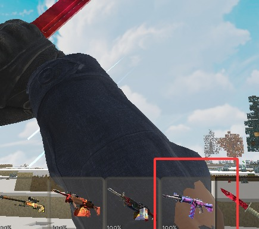

# 玩家反馈规划：制作进度、CT手臂、快速投掷与中英探员语音

日期：2026-09-25；源码基线 `0a510c1`，当前交付为取消自动备份后的兼容系列1（1.0/1.2兼容修订及1.6.0全量/轻量）。**本次仅规划和素材检查，未修改玩法、模型、存档或已安装包，也未生成新的scmod。** 用户追加的“玩家选CT/T后能主动选择语音来说”已纳入第5节。

建议实施顺序：先修CT重刀穿模和投掷响应，再落实制作梯度，最后交付独立语音附属包。全部建议数值均待本规划审阅，不把本页候选值当作已上线行为。

## 1. 霰弹枪增强是否已经完成

**最新版1.6.0已做，1.0/1.2兼容修订保留各自旧版战斗平衡，不能将兼容支持等同于获得最新伤害增强。**

当前公式：`(原基础整发伤害 + 初级补偿 × max(0, 1 - 枪械等级/20)) × 成长伤害倍率`。补偿逐步淡出，到枪械Lv20归零；成长倍率继续增加，不会因补偿淡出导致升级后整发伤害倒退。

| 霰弹枪 | 增强前Lv0整发伤害 | 最新Lv0 | 初级增幅 | 静止基础散布半角：旧→新 | 弹丸数 | 最新Lv0理论射速 |
| --- | ---: | ---: | ---: | --- | ---: | ---: |
| Nova／新星 | 33 | 54 | +63.6% | 2.42°→2.10° | 9 | 68.18发/分 |
| XM1014 | 24 | 36 | +50% | 2.32°→2.05° | 6 | 171.43发/分 |
| Sawed-Off／截短 | 36 | 60 | +66.7% | 3.55°→3.20° | 8 | 70.59发/分 |
| MAG-7 | 36 | 54 | +50% | 2.42°→2.10° | 8 | 70.59发/分 |

口径：原厂无皮肤、枪械Lv0、近距离全部弹丸命中身体的理论攻击力，**不是每颗弹丸的伤害，也不是任何生物都扣相同血量**。例如Nova是9颗合计54，不是9×54。皮肤倍率、护甲、命中部位与生物韧性另计。上表“增强前”指9月24日前的平衡基线。

已落地的配套：霰弹一批产出12发（可批量24/36）；初级射速按9月25日要求恢复CS2基准；开/关进阶枪感的散布路径都应用收紧。最新射速全表见[分级表](gun-rates-2026-09-25.md)。实现入口为 `ScSurvivalBalance.PowerAtLevel`、`EffectiveGunStats.PelletPower`、`ScGunHandling.LegacyCone` 与 `gun_handling.json`。

仍弱时应先定位：使用的是不是旧版兼容包；实战距离是否过远；多少弹丸实际命中；对方护甲/韧性如何。当前进阶枪感中Nova约6格内不开始衰减，截短约4格，不能用20格外输出判断贴脸性能。本轮建议先利用制作梯度给霰弹枪完整的前期定位，**不再直接叠第二轮统一增伤**。后续验收以3/5/8/12格命中率和击杀耗弹量决定是否微调。

## 2. 制作等级重排：前期手枪、霰弹与冲锋，后期步枪和狙击

### 2.1 当前机制与问题

这里的“制作等级”是**玩家人物等级** `PlayerData.Level`，不是枪械击杀成长Lv，也不是一个可升级的枪械台等级。当前枪械台没有独立科技树；代码在组装和确认扣料时检查玩家等级。创造模式和关闭游戏制作等级限制时会放行。

当前最终门槛：手枪4；全部冲锋枪/霰弹枪6；步枪8；狙击枪/机枪10；Zeus12。配方前面的逐枪switch虽然写有2/3/4等数字，但后面又按枪械类别覆盖，规划实施必须替换**最终生效表**，不能只改无效的前置数字。

问题在于入门枪出现偏晚，同类别缺少梯度；冲锋枪和霰弹枪刚可制，步枪紧接着解锁，前期近战武器的使用窗口很短。出生赠送已经是默认CT刀、满弹USP-S和3个通用弹匣，本轮保留这项一次性赠送，不因更新再发一份。

### 2.2 推荐等级表（覆盖全部35款枪）

| 人物等级门槛 | 武器 | 当前门槛 | 定位 |
| ---: | --- | --- | --- |
| 2 | Glock-18、P2000、P250、USP-S | 4 | 入门、防身、第一把可自行补造的枪 |
| 3 | Nova、Sawed-Off；Dual Berettas | 6；4 | 近身爆发/双持手枪路线 |
| 4 | MAC-10、UMP-45 | 6 | 第一批自动火力，与泵动霰弹并行 |
| 5 | Five-SeveN、Tec-9、CZ75、沙鹰、R8 | 4 | 进阶副武器；避免高威力手枪与入门枪同档 |
| 6 | MP9、MP7、MP5-SD、PP-Bizon；MAG-7 | 6 | 前中期主力，各有射速/消音/弹量取舍 |
| 8 | P90、XM1014 | 6 | 近战路线后段：高容量冲锋、自动霰弹 |
| 12 | Galil AR、FAMAS | 8 | 首批步枪，进入中后期 |
| 14 | AK-47、M4A4、M4A1-S | 8 | 后期主力步枪 |
| 16 | AUG、SG 553；SSG 08 | 8；10 | 开镜步枪/第一把狙击枪 |
| 18 | AWP；M249、Negev | 10 | 重型狙击与持续压制 |
| 20 | SCAR-20、G3SG1；Zeus | 10；12 | 顶档连狙及特殊近战爆发 |

这是一版可直接实施的候选表，不需要增加新材料或枪械编号。已有枪不因人物等级不足而被没收、禁用或降级；限制仅针对新制作。维修、换皮、已安装计数器的成长仍按现行规则，不把“维护旧枪”误变为“重新解锁整把枪”。当前计数器安装门槛3暂保留。

“后期”取决于世界经验来源，不承诺固定第几天。当前原版每个经验单位约增加 `0.012 / 1.08^(floor(人物等级-1))` 级，第三方Mod可能改变经验获取；需用目标Mod组合记录从Lv2到Lv12/20的真实时长。若步枪等待过久，整组12/14/16/18/20可统一下调2级，不能只把一把强步枪提前造成捷径。

### 2.3 早期成本同步建议

只降低等级而材料仍需大量精密机构，会出现“显示解锁但实际做不起”。建议第一轮仅调整入门泵动霰弹和MAC-10/UMP-45，保留其他枪当前材料表，减少同时调整项。

组件缩写：B金属坯件、M精密机构、H握持组件。当前B=铁8+煤3；M=B1+铜6+锗2；H=皮革4+木板2+铜1。

| 路线 | 当前组件费用 | 候选费用 | 候选展开原材料，不含弹药和枪械台 |
| --- | --- | --- | --- |
| 入门4款手枪 | B3 M1 H1 | 保留 | 铁32、煤12、铜7、锗2、皮革4、木板2 |
| Nova/Sawed-Off | B5 M2 H2 | **B5 M1 H1** | 铁48、煤18、铜7、锗2、皮革4、木板2 |
| MAC-10/UMP-45 | B5 M3 H2 | **B5 M2 H1** | 铁56、煤21、铜13、锗4、皮革4、木板2 |

建议不改M的通用配方，防止同步降低所有后期武器成本。上述早期费用仍需锗，适合当前工业/筛子等Mod环境；纯原版难度需单列试玩，不把人物Lv2误称为开局无需采矿即可制作。

弹药保持人物Lv1可制：通用弹匣×2=铁1+铜2+火药3；霰弹×12=铁1+铜1+火药2+帆布1。维修单次取整与每10枪械等级20%的现行规则保留，本轮不再变维修价格。

### 2.4 防止解锁顺序被其他入口绕过

- 枪械台列表/配方详情/图鉴/按钮禁用说明全部读同一张门槛表，显示“需要人物等级14”，并与枪械Lv标签区分；可预览未解锁枪，不能扣料。
- 图鉴皮肤枪和计数器模板在生存模式不能绕过基础枪制作门槛；创造目录保留自由取用。
- 游戏主动关闭制作等级限制时尊重该设置，并在界面说明“当前世界未限制制作等级”；不悄悄强行开启。
- 同伴默认装备、击杀敌队取得的武器、箱子战利品和第三方商店要盘点。玩家说的是制作进度，建议首轮允许合法战利品提前使用，不额外加使用锁；若要严格限制全获取路线，需要另审掉落/召唤方案。
- 高等级武器的钻石、光学组件和机构费用继续保留，等级和材料共同构成门槛。

## 3. CT重刀：内层手臂从袖子穿出

### 3.1 已看到的证据

提供的视频为1536×854、约59.35fps、344帧、5.80秒；约0/1/2/4秒重刀抬臂姿态附近可重复看到右臂靠屏幕下缘的袖筒边缘露出肤色/内层几何。截图红框也能看到该现象。左臂在该短视频中大部分被遮挡或动作很快，**尚不能认定左右根因相同**，需按用户提示一起检查。

[视频抽帧对照](player-feedback-20260925/video-contact.jpg)。它仅作动作定位；不会将这段重刀视频当成投掷延迟的证据。

### 3.2 初步代码线索与具体修复方案

`TacticalArms.ResolveSet` 当前将“默认手套/手臂”或“自选手套”与独立 `ct_sleeves`/`t_sleeves` 分层绘制；导入脚本分别提取 `firstperson_default_gloves_arms` 和 `firstperson_sleeves`。重刀时内层裸臂与袖层可能在大角度扭转中穿插。现有 `Cs2SkinnedMesh` 还对前臂twist骨做了移植侧的近似重建。**这些是优先排查点，不是已经确认的唯一根因。**

1. 固定同一动画时间，分别渲染默认内层、袖层和叠加层；查看实际暴露三角面属于哪个mesh/material，确认不是重复绘制原玩家手臂。
2. 对CT/T左右上臂、前臂、手腕的bind matrix、骨骼映射、权重、twist姿态逐项比较；两层必须使用各自正确逆绑定、同一动作时刻与最终坐标。
3. 首选修复原导出资源的bodygroup/遮蔽关系：CT封闭袖筒应隐藏其内应被遮住的裸臂三角面。使用**派生网格和角色对应遮蔽表**，保留源导出；不能按“所有肤色像素”全局删除，也不能把T应有的露肤一起剪掉。
4. 若根因是袖子绑定/权重错误，先修绑定，再评估袖端长度。只有确认几何遮盖不足时才做小范围袖端补面/延伸，不整体放大袖子或移动整条胳膊掩盖问题。
5. 自选手套的额外裸臂部分需逐组核对；默认、运动、专业、驾驶手套均覆盖。保留握刀接触、双手方向和既有第三人称手套光照修正。

验收矩阵：CT/T/默认角色×默认及5款手套×默认刀与22款刀型的重击、轻击、连击、切出、检视；俯仰-80°/0°/+80°，站立/蹲下，16:9与手机宽屏，左/右手表现。先对视频中的刀型重击全片段按帧检查，再扩大范围。GPU离线帧和实机录像分别记录；不以静止一帧正常宣布修复。

## 4. 道具不能“秒投”：当前时序与快投候选

### 4.1 当前确实有强制等待

`ScGrenadePreparation.Step` 会记住松手，但必须等 `ReadyAt = StartedAt + pullSeconds` 才开始投掷，随后等 `.Throw` 动画事件才生成实体。切出/动作忙时 `RequestThrow` 直接返回，可能把很短的点击吞掉。强弱投和各设备还有松手防误触门控，不能简单删除所有门控。

从当前动画catalog读到的时间（不含帧调度，已拿在手且动作空闲）：

| 道具 | 拉针/准备 | 强投额外等到出手事件 | 快点后最早强投 |
| --- | ---: | ---: | ---: |
| HE、闪光、烟雾、诱饵 | 0.9666秒 | 0.06667秒 | 约1.033秒 |
| 燃烧弹 | 0.9666秒 | 0.033335秒 | 约1.000秒 |
| 燃烧瓶 | 1.1332秒 | 0.033335秒 | 约1.167秒 |

各道具切出片段还约1秒；是否在某种操作中完整叠加，需实机记录输入到出手，不能把上述1秒直接认定为完整用户延迟。弱投事件部分为0秒，HE/闪光约0.133333秒。

### 4.2 推荐交互：快速投掷默认开启，保留完整动作选项

“秒投”按不用等待整段拉针动画理解。建议提供“快速投掷／完整准备动作”设置；第一轮默认快速，完整模式保留现有长按拉针体验。以下为目标时序：

- 已持有且可操作：单击强投/弱投后，普通道具约0.15秒实际出手，燃烧瓶约0.20秒；目标窗口包含缩短的准备与出手事件，不是只缩短动画显示。
- 刚切到道具后立刻按投掷：缓冲本次新按下动作，缩短允许打断的切出尾段至最多约0.15秒，合计目标约0.30～0.35秒；保证一次点击只投一次。
- 想长按瞄准：快速准备完成后维持持有姿态，松手后下一更新开始出手，额外事件等待不超过约0.05秒。松手不再重新播放整段拉针。
- 切入道具时已经按住攻击键不算新点击，继续保留防误投规则；键盘、触屏、手柄各自记录按下/松开源，另一输入源释放不能帮当前源投出。
- 动画按准备/出手两个片段统一映射，声音也跟随新时间；不能“弹已飞走、手里还完整拉针”或同一声音重复播放。若用户希望真正零等待，可后续选“下一逻辑帧出手”，本规划首选保留0.15～0.20秒可见手势。

仅在成功提交库存事务时扣一件并生成一颗；切槽、死亡、菜单、掉落、人数/投掷物上限、背包变化取消未提交动作。出手后的引信从实际生成开始，伤害/范围/物理速度保持现行数值，不把快投变成额外威力增强。后摇可缩短但保持最小单次周期建议0.45秒、燃烧瓶0.55秒，防止按住按钮每帧投出。C4安放、拆弹、小鸡蛋不共用这套快投开关。

需新增调试测量：切槽、新按下、松开、开始准备、事务提交、实体生成五个时间戳；30/60/120fps测试已持有、刚切入、长按松手、强弱投、连续点击与多输入混用。目标是响应稳定、少按一次不会丢，多按不会多扣，不承诺低帧率设备真实延迟绝对小于某毫秒。

## 5. 探员语音：独立附属包，中文/英文统一选择

### 5.1 素材检查结果

| 输入包 | ZIP大小（十进制MB） | WAV条数 | 解压总量 | 可读WAV时长 |
| --- | ---: | ---: | ---: | ---: |
| 中文语音包(2).zip | 677.43 | 7,913 | 768.93 MB | 约143.74分钟 |
| CSGO AGENT VOICE.zip | 1,123.77 | 11,213 | 1,244.18 MB | 约230.84分钟 |

两包有7,891个相对语音路径可对应。英文所有WAV、中文7,911个可直接读取的WAV为44.1kHz/单声道/16bit。中文另有：`idf/ctmap_cs_source98.wav` 仅36字节、缺有效音频块，列入排除；`leet/tmap_cs_source43.wav` 使用格式3（浮点WAV），需转码检查，不应直接当坏文件删掉。

CT现有模型是SAS、T是Phoenix，素材中恰有 `sas` 494条和 `phoenix` 360条，两种语言各854条。两套合计约1,775.15秒。**文件夹/文件名审计不等于每条内容已听辨或完成中英字幕核对**，语义选择、口音、错配和响度仍需逐条试听。中文包有少量非探员/人质路径，不自动混进CT/T语音池。

建议首发采用CT→SAS、T→Phoenix；每个NPC固定对应阵营音色，触发时随机选该音色的语句，不让同一个实体每句话换一个探员。其他SAS/GIGN/FBI/SWAT等音色以后再做可选扩展，不能把未筛选的全部11,000条随机混播。

### 5.2 分包、大小与音频参数

建议独立 `CS探员语音` scmod，同时含中文/英文，主包与轻量总包均不内置其音频；用户只装一个语音附属包，不需要两个同身份语言包同时启用。主包提供可选事件接口；NPC自动语音要求战术功能存在。旧兼容版保留设置，在对应实体休眠时不播放；缺接口则附属包停用相关语音功能，不阻止世界加载。

首发“精选版”：SAS/Phoenix各约40～60个语义明确的片段，两种语言合计160～240条。目标约3～8 MB，需实际转码和验收后才能给最终包大小。避免把两个原ZIP直接并进总包。

格式建议：OGG Vorbis、单声道24或32kHz、目标平均40～56kbps；统一对话响度约-18 LUFS、真峰值不高于-1dBTP，保留自然开头/结尾，避免硬切辅音。若引擎/手机解码对某采样率不稳定则使用32/44.1kHz，并实测CPU与包大小。16～32MB解码缓存预算，按需加载，不在进入世界时把数小时PCM全解进内存。

容量估算只作预算：SAS+Phoenix全部两语1,775.15秒，按48kbps纯音频约10.65 MB，容器/短片段开销后约12～18MB可作为扩展目标；全量所有音频22,474.63秒按同码率约134.85MB起，尚未计开销，因此不建议首发全收录。原始ZIP只读保留，派生包记录来源路径与哈希。

### 5.3 全局设置和玩家主动选句（用户追加要求）

位置建议：**模组设置 → 探员语音**；角色外观页面只放“语音设置”入口，避免把服装选择和讲话按钮混成一个操作。

设置项：

- 语音语言：中文／英文，默认中文；影响玩家选句、召唤CT/T和自然生成CT/T。切换后丢弃旧语言待播队列，当前已开始的一句正常结束，下一句采用新语言。
- 主音量：0～100%，默认70%；玩家主动语音开关、NPC自动语音开关分别控制，NPC自动默认开。
- 玩家角色声线：默认跟随外观（CT→SAS，T→Phoenix）。本期不承诺任意混选其他探员；不选CT/T时不给玩家强塞CT/T声线。
- 附属包未安装：显示“需要安装探员语音附属包”，其余玩法正常；选择不丢失，装回附属包仍使用原设置。

**玩家主动讲话流程：**

1. 选择CT/T人物后，打开“语音菜单”。键盘可重绑定独立按键，默认候选V但需先做按键冲突检查；手柄使用独立可绑定动作；手机在现有触控布局里加可移动/隐藏的“语音”按钮，不挤占强弱投键。
2. 菜单分类“战术／回应／投掷／情绪”，每页6～8项；常用项可收藏到快捷栏，长按打开轮盘/列表、选择确认播放，取消菜单不讲话。
3. 每项有中文语义标签和当前语言标记；选“收到”“跟上我”“发现敌人”“需要支援”等**语义项**后，从该项同义录音中选一句，允许“具体语句”子页选定某条。音频实际内容与标签需试听校验，标签不是已经确认的逐字转录。
4. 设置页提供“试听”，仅当前用户听到且不进入世界广播；游戏内“说出”从当前玩家位置播放，附近可听。字幕建议显示说话者+已核对的中文含义，可关闭；不暴露资源文件名。
5. 手动语音成功播放后冷却3秒；同一句至少15秒不重复；同一玩家最多一条待播命令。无角色、死亡、正在切换世界时取消待播。语音不占武器忙状态，不阻止开枪/投掷。

玩家手动选择与NPC自动事件分开：用户可以自己喊“跟我来”等语句，本期只是说话，不暗含“语音控制NPC AI”。如果以后需要语句下达命令，单独确认其玩法和输入优先级。玩家自动战斗喊话首发默认关闭，避免手动语音之外突然替玩家说话；NPC自动语音按下面规则执行。

“全局”首发指本机游戏设置、所有该机听到的CT/T事件统一语言；单机/同机分屏可实现共享设置与去重。本项目尚无完整联网传输，**不承诺其他客户端自动听见或语言同步**。未来联网须发送事件ID/说话实体，不发送音频字节，并定义主机/本地语言策略。

### 5.4 NPC自动语音事件与候选触发率

自动只在真实事件或合理空闲状态触发；不用每帧随机骰，不能播出与状态矛盾的“只剩一个敌人”等信息。召唤T可能是友方，阵营音色与敌我关系分别判断。

| 事件 | 建议概率/间隔 | 语义池与约束 |
| --- | --- | --- |
| 成功召唤／自然生成CT/T | 70%，延迟0.5～1.5秒 | `radio.letsgo`、`inposition`；读档恢复不重播出生欢迎 |
| 附近空闲巡逻／跟随 | 每40～75秒检查，25% | 只选不报告虚假情报的短句；玩家32格内且非战斗 |
| 首次发现可见目标 | 60%，同目标20秒冷却 | `radio.enemyspotted`；目标确认后触发 |
| 有效受伤 | 25%，每实体8秒冷却 | `radio.takingfire`／`help`，不每颗弹丸喊一次 |
| 确认击杀目标 | 45%，每实体10秒冷却 | `enemydown`；同一死亡只消费一次事件 |
| 投掷物实际生成成功 | 60%，每实体8秒冷却 | `ct_grenade/ct_flashbang/ct_smoke/...` 及对应T事件，不能在取消投掷时喊 |
| 跟随/等待命令确实改变 | 80%，6秒冷却 | `followingfriend`／`waitinghere`；首发只挂已有命令 |
| 换弹、战斗移动 | 默认关闭，后续可选 | 无已核实对应录音则不编造配对 |
| 死亡 | 首发默认关闭语音层 | 避免与原生受伤/死亡音重复叠加 |

随机选句使用每个实体自己的短期不重复队列，至少最近3句不重复；音色固定，语言跟随全局。普通自动语音每实体最少间隔8秒，周围30格内同时最多1条自动语音；所有语音同听者最多2路，玩家主动语音优先，普通闲聊可被丢弃而不是积成几十条队列。目标丢失/实体死亡/换语言/卸载世界立即清理未播放项。

语音按NPC位置做距离衰减，自动语音候选最远32格、手动语音24格；隔墙适度降音量但不要求第一版实现复杂声学。旁白不广播全图，不触发原有枪声吸怪系统；除非以后明确要“喊话引怪”，不能让纯音效附属包改变仇恨或潜行。

### 5.5 内容映射与缺词回退

以 `(角色音色, 事件, 变体ID)` 建索引，中英相对路径作为初始匹配线索；发行清单保存显示语义、原路径、处理后哈希、时长和语言。匹配到文件不代表已匹配语义，仍须听辨。

中文缺失时先找同角色、同事件的另一条中文；仍缺则静音/隐藏该手动项，不默认插一条英文破坏全局中文选择。反向相同。损坏音频、超长地图专用台词、回合胜负/敌人数目等不适用片段不入首发池。

语音附属包移除或切到旧版时，音色/语言设置保留，但语音队列不进世界存档。若之后加入NPC固定persona，使用兼容系列的可保留字段或稳定实体身份选择，不能因附属包缺失删除同伴。主包不硬依赖语音附属；附属更新音频不改变枪械/实体ID。

## 6. 版本兼容、发布与审阅项

本轮最终实现仍须遵守：兼容系列内双向替换；不自动生成备份，由玩家手动备份；保留原始旧包、原CS2导出和用户语音ZIP；不删除未知枪械或休眠实体；全量/轻量玩法一致，语音同一附属包复用。

制作新梯度默认只在最新玩法版本生效；1.0/1.2兼容修订继续保留历史配方/门槛。切回旧版可能按旧规则制作，再带回新版——这是支持历史规则切换的结果，不能同时声称跨版本也强制同一科技进度。若想三个版本统一新制作梯度，应另行选择，并明确不再保留旧配方规则。已有枪状态始终保留。

验收与工作拆分：

| 顺序 | 内容 | 通过条件 |
| --- | --- | --- |
| P0 | CT重刀穿模修复 | 分层找出暴露来源，CT/T左右手全动作/多视角无明显穿插，保持握持位置 |
| P0 | 快速投掷 | 事件实测达到候选响应，切入点击不丢、一次只扣一件/生一颗，多输入不误投 |
| P1 | 制作与前期经济 | 35枪门槛一致、界面/确认同源、等级不足不扣料、早期三路线都可走 |
| P1 | 语音附属与玩家选句 | 中英文一致、CT/T声线匹配、菜单/快捷键/触屏可用、试玩音量合适 |
| P1 | CT/T自动语音 | 召唤/自然生成/战斗事件正确、读档不刷欢迎、随机不重复、不串队列 |
| 发布 | 四包/附属兼容回归 | 卸载语音仍可进世界，往返保留枪械和同伴状态，零自动snapshot，最终包内检查 |

建议本次审阅重点：①认可人物Lv2～20的梯度及两组入门成本调整；②“秒投”采用默认0.15～0.20秒快投还是坚持原始完整准备；③语音首发只做SAS/Phoenix精选双语，玩家主动选句+NPC自动语音；④玩家自动喊话默认关闭、NPC默认开启。以上是待审选择，不需要现在安装或覆盖任何包。

证据入口：[素材/音频头/投掷时序JSON](player-feedback-20260925/audit.json)、[只读审计脚本](../tools/player_feedback_audit_20260925.py)。本次没有试听完整语音库，没有复现道具秒投的实机录像，也没有修好穿模；这些都作为后续实施与验收项明确保留。
