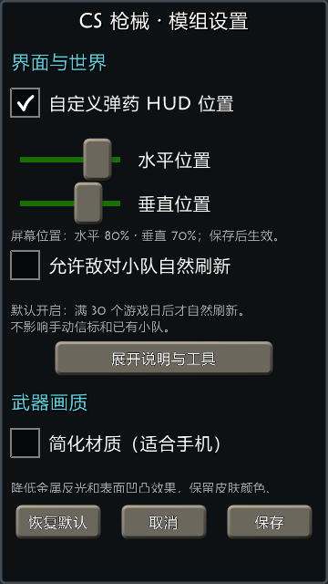
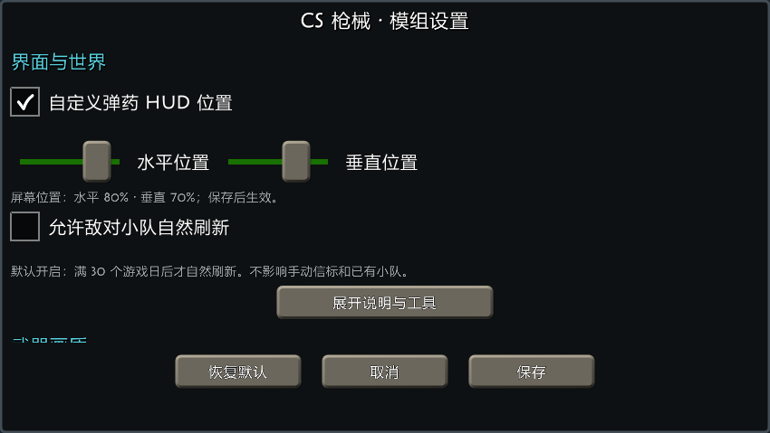

# 1.3.0 音效、HUD、投掷物与自然敌队设置

本轮完成用户指定的五组改动，使用 Full/Lite 共用源代码，公开版本仍为 **1.3.0**，运行日志标识 **gameplay-audio-20260927**。只更新自己的核心、战术、语音 DLL、资源索引，并新增一个空爆图集；原有枪械/人物贴图、模型、动画和音频资源不重压缩、不删除。第三方 NEO/NMM 未改。

| 文件 | 字节数 | 十进制 MB |
|---|---:|---:|
| [API1.9]CS武器1.3.0-轻量包.scmod | 35,421,952 | **35.42** |
| [API1.9]CS武器1.3.0-探员包.scmod | 37,082,470 | **37.08** |
| [API1.9]CS武器1.3.0-全量包.scmod | 523,901,336 | **523.90** |

已替换 output 同名文件。分体版需要同时更新轻量与探员；全量独立使用。更新后重启游戏，避免同版本旧 DLL 留在当前进程。

## 音源并发、释放与快速切刀

检查发现旧切刀声音每次都创建一次性 Sound，但不随该玩家切换武器停止，快速来回切刀可以叠加尚未播放完的切出声音。没有发现这条路径主动把 Pitch 降速；不能据代码直接断言用户听见的“慢放拉长”全部由叠音造成。

新增 ScOwnedAudio 只管理我们创建的短音源：

- 同一第一人称模型只保留最新切刀 draw 声。再次切换武器或切为空手时释放旧 draw 音源，原音频文件、采样率和切刀播放速度保持。
- 自己的并发音源上限 24；NPC/世界枪声最多 12，探员语音最多 2，其他类别分别有界。大量重叠 NPC 枪声会被限流，不改变射速、弹药、伤害或 AI。
- 玩家枪声和界面反馈有单独类别；总量满时可优先释放我们自己的低优先级世界枪声。击杀提示按自己的反馈通道替换，避免同帧大量击杀堆积。
- 结束或过期音源及时清理；退出世界释放自己持有的音源。共享 SoundBuffer 仍归 ContentManager，不随单个播放实例销毁。
- 分配失败后短暂退避，避免每帧继续创建无效音源刷错；保留限量统计。
- 保留世界音量衰减与传播延迟；固定正常 Pitch，不拿帧耗时或模拟时间倍率去拉伸切刀声。

CS_AUDIO 每 10 秒记录 active/peak/played/dropped/replaced/expired/failed，快速切刀另有受限的资源名、实际 Pitch、采样率、声道数与长度日志。这不是全游戏/所有 mod 的音频总预算，其他模组和原生音效仍可能消耗后端资源。

原生 OpenAL 静音夹具连续创建/替换 200 次：始终只保留 1 个 draw 音源，实际 AL Pitch=1.0，缓冲 UseCount=1；清理后音源数和引用数回到基线。30 次世界声音请求仅分配上限 12 个。测试用零样本 PCM 和进程内 OpenAL null 驱动，不播放噪声、不改系统音量；**Android 驱动行为与用户“拉长”听感仍待真机复测**。

## 弹药 HUD 与设置页

模组设置最上方新增：

- “自定义弹药 HUD 位置”；
- 水平/垂直 0–100% 滑块，按控件区域比例保存；
- 未启用自定义时继续自动右下角避让；启用时按指定位置显示并夹紧到屏幕内。

位置保存在本设备的 ScCsgoUi.json，方向/分辨率变化后仍按比例布置。旧文件缺少新字段时保持原来的自动布局；设置在保存前不改变全局配置，保存失败仍恢复先前值。此处没有改写世界或枪械存档。

页面把界面/世界开关置顶；交流、视角恢复、语音入口和只读世界诊断折叠进“说明与工具”。横屏并排显示两个位置滑块，窄屏纵向排列，保存/取消/恢复默认固定在底部。其他已有设置仍可通过滚动访问。

下面是离屏原生控件截图，不是手机游戏截图：

## 投掷物切出期间可操作

投掷输入可以打断投掷物 deploy，不再等待切出动画结束；也处理库存已切换、第一人称还显示旧武器状态的过渡。进入 pullpin 时同步选中物品标记并清除旧 DrawReadyAt，下一次绘制不会重新启动 deploy。

这按用户的具体说明实现为“取消切出等待”：仍保留按住准备、松手投掷、拔销/投掷片段的实际释放事件，以及库存事务、取消/重复输入保护。并非点击后跳过全部动作立即凭空生成投掷物，也不会顺便解除枪械换弹/开火锁。

## 燃烧弹三秒引信与空爆

Molotov/Incendiary 的空中引信由 2 秒改为 **3 秒，从实际掷出创建飞行状态时开始**，不从切出或按住准备时开始计时。落地触发、遇水熄灭、烟火交互、模拟小步和地面伤害区域仍沿用既有规则；因此接触地面仍可能在三秒前燃烧。已有飞行状态保留保存的剩余时间，不读档重置引信。

新增火球画面来自本地保留的 CS2 flame_omni_seq0 序列，抽取 16 帧制作带留边的 4×4 图集：

- Full：1024×1024 PNG，1,017,901 B。
- Lite：512×512 WebP quality 85，**113,060 B**。

这是 CS2 纹理帧派生的受限 billboard 效果，不宣称移植完整 Source 2 粒子系统。图集源帧路径和 SHA-256 保存在发布证据，Full 派生图也随源代码提交，正常后续构建不会漏资源。

爆开时先在飞行位置产生约 0.85 秒的视觉火球；找不到合适地面时，投掷物仍清理，但画面可以显示，不再直接无声无影消失。不会新增悬空的持续伤害火区。瞬态视觉数量有上限，不限制实际投掷/伤害对象；退出世界清理视觉，不把短暂特效写入存档。

## 敌队自然刷新开关

新增“允许敌对小队自然刷新”，默认开启。只有 **已流逝满 30 个游戏日** 才允许自然生成，使用游戏的 DayDuration 计算；30 日前或开关关闭时，自然适宜度为零。开关是本设备设置，不新增敌队存档格式。

不影响手动三/五人信标，不删除已经存在或已保存的小队。原有生存模式、生态模式、人口、落点和未加载小队避让仍生效。已有五人队日期规则不变，因此默认满 30 日后自然队伍按原有后期编制生成。

CS_SETTINGS 记录保存的 HUD/刷新配置，CS_SPAWN 记录自然刷新开关和宽限时间；CS_GRENADE 记录有限量的准备、实际释放引信与火球触发。之前的长帧、NEO 同步及资源准备日志继续保留。

## 验证与边界

- 新增功能：Full/Lite 各 **255 项**通过，覆盖真实切出状态中断、下一帧不重启 deploy、释放授权、HUD 夹紧/保存重读/未保存不生效、自然刷新边界、原生 OpenAL 生命周期和 UI。
- 无支撑地面的生产 Detonate 路径：发出视觉，原投掷物清理，不创建悬空伤害区。
- 原生 AI：两版各 15 项通过，更新三秒引信和 30 日门槛预期后，验证实际自然生成函数、开关和手动队伍回滚。
- 两版人物采样各 2,145 项、NPC 几何/绘制各 4,156 项、外观/NEO 各 7,918 项通过。
- 轻量完整资源检查 34,458 项、1,572 帧、524 动作通过；新增图集通过原生图片解码。
- 纹理准备、烟雾弹碰撞、CT/T 原生加载、日志、官方/本地前置组合、四组存档兼容矩阵、191 份编码资源与软件解码路径、三包 Game.ZipArchive 回读均通过。

新增 UI 截图已检查。以上是 Windows API 1.9.3.1 原生验证，不等同于 Android 听感/性能/空爆实机验收。下次手机重点复测快速往返切刀、切出中强投/轻投、空中三秒火球、HUD 自定义位置及开关保存。

## 交付记录

[完整哈希、资源出处及验证记录](release-gameplay-audio-1.3.0-2026-09-27-evidence.json)。工作区为 .tmp/gameplay-audio-130-20260927，baseline 保存原交付；不创建玩家世界自动备份。未改手机、已安装 Mods、玩家世界、极简版或历史包。

源码的 SurvivalSelfTest 仅更新本轮引信断言；此前未提交 Zeus 修改仍保留且不纳入本提交。构建输入哈希照实记录工作区状态；v5/schema6/rules7、旧物品 ID 和原枪械平衡不变。

复现使用 tools/dev.ps1：prepare_gameplay_followup.py → 构建 stage 的 core/agents/voice 和 full 对应三项目 → package_gameplay_followup.py → stage_gameplay_checks.py → check_gameplay_followup.py 的 build/features/load/full-load/compat/ai/codec/runtime/full/focused/textures → publish_gameplay_followup.py。
