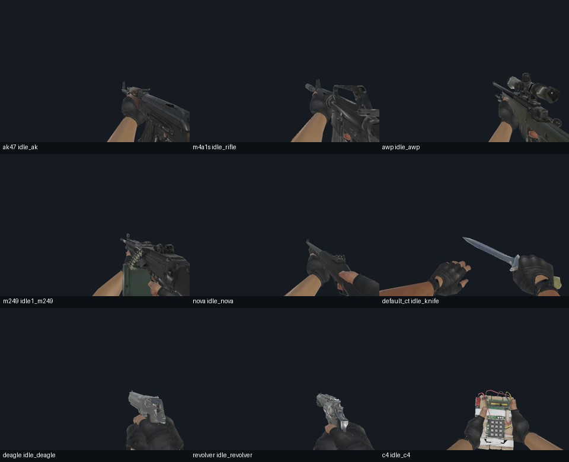
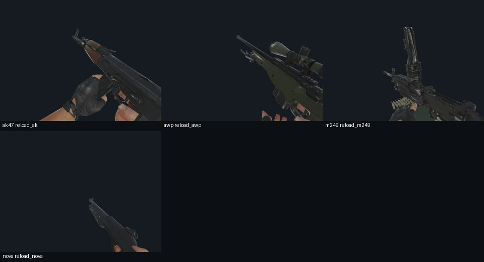

# CS武器 1.3.0 独立极简包

用户已授权按极简方向正式制作。本包是第三种独立发行包，与全量/轻量三选一，直接导入 `.scmod`。

交付：`output/[API1.9]CS武器1.3.0-极简包.scmod`

- 大小 **28,596,863 B = 28.60 MB = 27.27 MiB**，低于十进制 30 MB 上限 1,403,137 B。
- SHA-256：`324de95ef77b43a7d236d6fccc619a0864f378713abc2ff9e335306d2e53c995`。
- API 1.9.3.1，公开版本 1.3.0；包名与既有武器包一致，不可同时启用多个版本。
- 现有全量 522,867,456 B、轻量 107,490,662 B 的哈希均未改变；未安装到 Mods，未修改玩家世界。

## 保留与删减

保留全部 **35 种枪械**、成长/耐久/弹药/计数器、工作台、手雷、C4、鸡和默认手臂。
所有枪的公开配置字段，以及 0–50 级容量、最大耐久、射速倍率和充能时间，均与当前轻量包逐项一致。
电击枪沿用已经发布的 1.3.0 数值，不另行调整平衡。

保留每种主战武器一个额外皮肤，共 13 个：

| 枪械 | 皮肤资源键 |
| --- | --- |
| AK-47 | cu_ak47_rubber |
| AUG | cu_anime_aug |
| AWP | am_lightning_awp |
| FAMAS | gs_famas_mecha |
| G3SG1 | so_green |
| Galil AR | cu_galil_candychaos |
| M249 | gs_m249_nebula_crusader |
| M4A1-S | cu_m4a1s_printstream |
| M4A4 | cu_m4a1_howling |
| Negev | gs_negev_thor |
| SCAR-20 | cu_scar20_intervention |
| SG 553 | cu_sg553_caution |
| SSG 08 | cu_ssg08_dragonfire_scope |

极简包不提供探员、同伴、敌对小队、战术拆弹挑战及人物/手套外观模块，也不包含它们的缓存、音效和贴图。
检视按钮及检视入口关闭。开火、换弹、消音器操作、刀攻击、投掷和装弹事件仍保留。
新制作/创造菜单只提供 CT/T 基础刀。为兼容已有世界，22 种原刀型的必要模型与动作仍保留，额外刀皮删去。

体积并非仅靠无损压缩实现：普通贴图上限为 **256**，物品槽等小图为 **128**，从全量原始贴图重新派生；
法线缩小后重新归一化，C4 数字、RGBM 环境、枪口特效等数据敏感贴图保持原样。
模型采用上一轮进一步减面结果；其完整实验集合由 980,038 面降至 475,998 面，最终包另外排除了不需要的旧皮肤模型。
原顶点属性保留，简化器保护边界/极值及混合骨骼；这不等于无视觉损失。
音效尝试转为单声道、最高 22050 Hz Ogg，仅保留比原文件更小的转换，时长误差小于 1 ms。

64 个动画资源文件、524 个片段名称、骨架、时长和事件保留。检视/LookAt 曲线清空且运行入口关闭；
其余曲线减少 489,463 个关键帧，保留端点和原关键值。简化误差阈值在原采样点为平移 0.01 源英寸、
旋转 0.15 度，不代表层级末端在所有插值时刻的严格误差界限。最终仍有画质与动作精度损失。
最后使用标准 ZIP Deflate 择小重压，载荷不变，额外节约 1,634,119 B；无需外部解压器。

## 存档兼容

保持 v5/schema6/rules7 和兼容系列 1。枪型、实例、皮肤、计数器模板、刀型编号不重排。
完整 44 枪皮目录继续识别存档；菜单仅过滤可用项，缺少的皮肤显示原厂材质但不清空原 ID。
玩家主动重新喷涂仍按正常游戏行为替换旧皮肤，不承诺在此操作后恢复旧选择。

四种战术物品保留同名惰性类型；原探员实体、战术子系统和外观数据通过已有兼容框架休眠保存。
切回兼容系列全量/轻量后可重新读取；不是继续模拟极简包没有的探员系统。
`Legacy=true` 是现有兼容机制对功能子集的标记，公开版本仍为 1.3.0。
模组不自动备份，由玩家自行管理备份。不要同时启用独立战术拓展。

## 验证

| 检查 | 结果 |
| --- | --- |
| 原生资源入口、实际 XML/存档保护钩子 | 11/11 |
| 原生数据库/休眠实体/别名/不自动备份 | 6/6 |
| 当前全量、轻量、极简三者双向状态/变更/两次重读 | 243/243 |
| 1.0、1.2 兼容修订包与极简双向矩阵 | 243/243 |
| 实际打包 DLL、数值、旧模板、音频、动画元数据及原生 GPU 检查 | 30,368 项通过 |
| 非检视片段起点/中点/终点原生渲染 | 1,302 帧 |

资源检查绑定最终包 SHA。GPU 检查覆盖内嵌刚性、蒙皮、AK/M4A1-S/AWP 的 OBJ 路径；
idle 在绘制手臂前断言武器自身可见，避免“只显示手臂也算通过”。13 个保留皮肤进行原生材质/模型解析和掉落渲染；
旧式几何皮肤还做第一人称渲染。已人工查看代表性待机、换弹及 AWP 皮肤图。
当前全量/轻量的 Tactical 物品类型位于配套 DLL，隔离兼容工具实际加载该 DLL 检查类型，未跳过此项。
历史矩阵中的旧版本是兼容修订包，不代表未经修订的原始 1.0 可以任意读取新存档。

以上是 Windows 原生引擎/离线回归，**未进行 Android 真机验收**，也不保证任意手机不会卡顿。
隔离渲染不覆盖完整实玩、瞄准镜 UI、联机及全部第三方组合；没有把测试帧数当作手机性能数据。

## 构建与来源

核心通过 `SC_MINIMAL` 条件编译隔离；正常核心构建默认关闭，当前全量/轻量包未重编译。
此次核心从现有工作目录隔离快照构建，包含既有未提交 Zeus 修订；其行为已与公开轻量包逐项核对。
那些预先存在的源文件修改不属于此次极简改动，未纳入此次提交。精确核心输入文件哈希见证据，
不能将当前提交单独视为该 DLL 的完整可重现源树；重新构建必须核对来源哈希和公开轻量数值基线。

以下工具均通过 `tools/dev.ps1` 运行，临时文件只写项目 `.tmp`：

1. 按上一轮轻量记录提取其 `ScCsgoResources.dll` 全部 ManifestResource 到 `.tmp/lite-smooth-20260926/embedded`。
2. `python -X utf8 tools/probe_extra_lite_reduction.py` 派生网格。
3. `python -X utf8 tools/build_minimal_resources.py` 派生贴图/音频/动画；随后 `dotnet build .tmp/minimal-130-20260926/resources/ScCsgoResources.csproj -c Release`。
4. `python -X utf8 tools/stage_minimal_core.py` 创建有哈希记录的核心快照；随后 `dotnet build .tmp/minimal-130-20260926/core/ScCsgoKnives.csproj -c Release`。
5. `python -X utf8 tools/package_minimal_130.py` 打包；`python -X utf8 tools/compress_minimal.py` 用标准 Deflate 压缩并核对每个文件载荷不变。
6. `python -X utf8 tools/stage_minimal_compatibility.py` 从提交 `5cd70c1` 派生隔离兼容检查器；编译后分别运行当前/历史三者矩阵。既有同伴的 CompatibilityCheck 修改不被覆盖。
7. 编译 `tools/MinimalCheck/MinimalCheck.csproj`，参数依次为极简包、公开轻量包、原版 Content.zip、输出目录。运行 TacticalLoadCheck 的 `--world-resource-gate` 与 `--compat-native`。
8. `python -X utf8 tools/minimal_contact_sheet.py` 只从本次报告所列帧生成联系图。
9. `python -X utf8 tools/publish_minimal_130.py --publish` 检查体积、ZIP/CRC、每项哈希、版本、资源清单、DLL 对齐、验证结果和全量/轻量原哈希后生成独立交付文件。

[最终包及验证证据](release-minimal-1.3.0-2026-09-26-evidence.json)记录文件清单、核心来源哈希、检查报告摘要/哈希。
[资源派生记录](release-minimal-1.3.0-2026-09-26-resources.json)记录删除项、转换前后哈希、贴图尺寸、音效及曲线简化误差。
