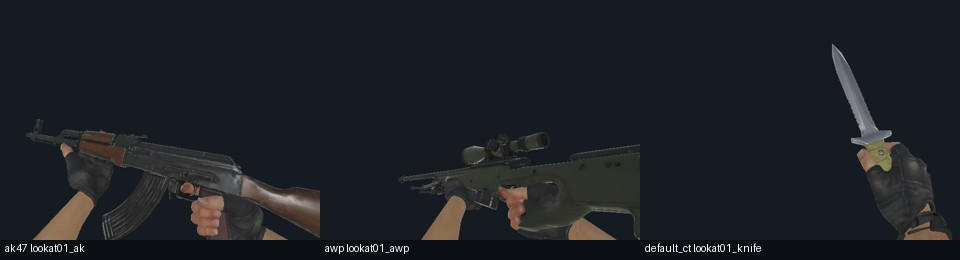

# 1.3.0 极简画质与检视修订

用户将上限放宽为 40,000,000 B，要求恢复轻量包第一人称枪械轮廓、512 颜色贴图，删除 CS 小鸡，并重新开启检视。
本次替换 `output/[API1.9]CS武器1.3.0-极简包.scmod`，公开版本仍为 1.3.0。

- 最终大小：**36,095,429 B（36.10 MB）**，比 40 MB 上限小 3,904,571 B。
- SHA-256：`df63ff45a1e51e6a3f0f4765660cb5a6ec0643108aed3c57c149404a71239639`。
- 原极简包：28,596,863 B，SHA `324de95ef77b43a7d236d6fccc619a0864f378713abc2ff9e335306d2e53c995`，留在阶段目录 `previous-published.scmod`。
- 当前全量、轻量包不变；没有安装 Mods 或读写玩家世界。

## 最终内容

35 种枪械、13 种额外主战枪皮及原有数值保持不变。枪械的内嵌几何和必要 OBJ 恢复为公开轻量包的对应字节，
不是全量原始高模，也没有为了本次体积目标重新减枪械面数。共恢复 158 项几何资源。
50 项枪械颜色/默认手臂贴图恢复为公开轻量包的对应字节，最高 512；法线、材质参数图仍为极简 256，槽图仍为 128。
沿用上一极简包的刀具、投掷物及辅助资源优化和压缩音效。

移除 12 项 CS 小鸡资源，包括模型、贴图、音效、动画配置和数据库模板。Mini 不注册自然生成和跟随交互，不提供生成蛋菜单/配方。
保存的生成蛋用同名惰性物品承载；旧鸡实体保留为兼容框架的休眠数据，返回完整版本时恢复原始实体 ID/数据。
探员、小队和人物外观仍不提供。物品布局 v5、schema6、rules7、兼容系列1均不变，不自动备份。

恢复全部 **90 段检视动作**及键盘/触屏入口。为与现有极简动作精度一致，只简化曲线冗余关键帧；
检视保留 236,251 个关键帧，减少 592,914 个，原采样点最大误差不超过 0.01 源英寸/0.15 度。
端点、剩余关键帧数值、片段名、骨架、时长和事件保留。该界限不是所有时刻层级末端位置的严格误差界限。
其他非检视动作与上一极简包逐值及原生骨骼矩阵对照一致。

最终使用已有 JSON、网格格式、原生资源读取器和标准 ZIP Deflate。
普通 zlib9 为 38,380,675 B，加强 Deflate 后节约 2,285,246 B；未随包引入新的原生编解码器。

## 验证与边界

- 原生资源/世界入口：10 项通过；原生数据库/兼容休眠：6 项通过。
- 全量/轻量/新版极简、1.0/1.2兼容修订/新版极简、上一极简/轻量/新版极简三组双向矩阵，各 243 项通过。
- Mini 原生检查：145,401 项通过，524 动作片段共 1,572 帧采样渲染。
- 非检视曲线与上一极简逐个浮点位比对、对应原生骨骼矩阵相等；枪械几何与轻量字节相等。
- 使用既有 `SwitchAnimationRegression` 检查实际检视控制器、切换后触发、重复按键不重启、状态锁和过渡。
- 检查鸡资源缺席、生成蛋惰性、自然生成/交互关闭，以及原鸡实体两次休眠读取后恢复原始 payload。
- 已查看待机、换弹和检视代表性图像。无 Android 真机性能验收；隔离渲染不是完整实玩/所有第三方组合验证。

## 检视体积和内存

开启检视前同画质候选包为 33,123,457 B，本版增加 **2,971,972 B**（包含微小元数据/核心差异），已满足 40 MB。
旧轻量的未简化检视按逐文件 zlib9 边际估算约 7.08 MB；这不是把 DLL 完全独立拆分后的精确占用。
全套原检视的数值数组约 16.07 MB，不包括对象/数组头；实际进程内存取决于加载和缓存情况。

Windows .NET 诊断按同一顺序采样 64 个资源，正常 LRU 最后保留 40 个动画资源，完整 GC 后：

| 版本 | 动画托管缓存增量 | 在该缓存中移除检视曲线释放的内存 |
| --- | ---: | ---: |
| 当前轻量 | 55,147,296 B | 23,862,800 B（49 段非空检视） |
| 恢复画质但未开检视的候选 | 19,492,416 B | 0 段非空检视；约 -5 KB 测量噪声 |
| 本次开启检视极简 | 27,249,872 B | 7,621,792 B（49 段非空检视） |

这些是特定缓存序列的托管内存，不是全套动画同时驻留，也不含模型、贴图、GPU、音频或峰值分配。
移除曲线只发生在隔离诊断进程，用于测量；游戏包不会运行这项诊断操作。
恢复 512 和更细模型会增加对应纹理/网格开销，不能把包体低于 40 MB 等同低内存保证。

## 构建与证据

全部命令经 `tools/dev.ps1`，阶段目录 `.tmp/minimal-inspect40-130-20260926`。
先设置进程环境 `SC_MINIMAL_INSPECT=1`，执行 `python -X utf8 tools/build_minimal_quality.py` 并编译资源项目；
设置 `SC_MINIMAL_STAGE=.tmp/minimal-inspect40-130-20260926`，执行 `stage_minimal_core.py` 并编译核心。
核心由派生记录中的 inspect 标记启用 `SC_MINIMAL;SC_MINIMAL_INSPECT`；默认 Full/Lite 行为不变。
随后运行 `package_minimal_130.py`、`compress_minimal.py`，全部检查及 `minimal_contact_sheet.py`，
最后 `publish_minimal_130.py --publish` 校验后替换极简包。普通发布目录之外的候选不会自动安装。

`MinimalCheck` 编译时 `MinimalStage` 指向本次阶段绝对路径；五个参数依次为候选、当前轻量、原版 Content.zip、
测试输出目录和上一版极简。最后一个输入必须用已保留的原极简，不能用被替换后的新包。
沿用工作区中已有 Zeus 修订构建；这些预存未提交文件未纳入本次提交，所有数值与公开轻量核对，精确源哈希见证据。

[发布证据](release-minimal-inspect-1.3.0-2026-09-26-evidence.json)；
[资源派生/逐项恢复记录](release-minimal-inspect-1.3.0-2026-09-26-resources.json)；
[开源方案和 30 MB 评估](minimal-open-source-compression-2026-09-26.md)。
