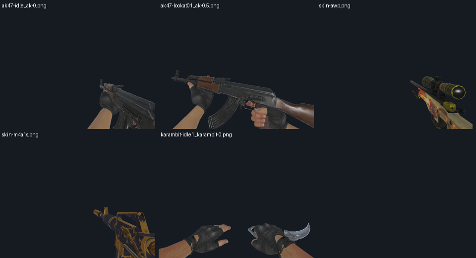

# 1.3.0 新轻量包与可选探员包

用户要求将现有轻量版完整拆分，武器包尽量低于 40 MB，保留原有资源，探员包另行压缩。本次以原 107,490,662 字节的轻量版为基准，公开版本仍为 **1.3.0**。

| 文件 | 字节数 | 十进制 MB | 用途 |
|---|---:|---:|---|
| `[API1.9]CS武器1.3.0-轻量包.scmod` | 39,927,338 | 39.93 | 单独使用的完整武器包 |
| `[API1.9]CS武器1.3.0-探员包.scmod` | 43,762,485 | 43.76 | 配套本次轻量包的可选扩展 |

轻量包替换 `output/` 中原有同名交付，探员包为新增文件。全量包和极简包未改动；未安装到游戏 Mods，未读写玩家世界。旧轻量交付保留在 `.tmp/split-lite-130-20260926/original-lite.scmod`，这是开发归档，不是游戏自动世界备份。

## 功能边界

| 内容 | 新轻量包 | 探员包 |
|---|---|---|
| 35 种枪械、44 种额外枪皮 | 全部保留 | 使用核心接口 |
| 22 种刀具及原有刀皮 | 全部保留 | — |
| 检视、开火、换弹、投掷动画 | 保留全部片段与事件 | NPC 动作保留 |
| 成长、计数器、弹药、工作台、手雷/C4、手机操作 | 保留 | — |
| CT/T 同伴、敌队挑战、盾牌、拆弹 | 保存旧物品身份和休眠实体 | 提供玩法 |
| CT/T 玩家外观、手套、小鸡、中英探员语音 | 保存恢复所需身份/数据 | 提供资源及功能 |

这次不是极简版的 13 枪皮、两把基础刀菜单：全部原有枪皮和刀具继续可用。小鸡按用户要求归入探员包；少量兼容类留在核心，以保留旧蛋、实体和存档记录。

安装时，用新轻量包替换旧轻量/全量/极简之一；需要探员时再加本次探员包。两份新包可以共存，不能同时启用旧总包或旧独立战术包。探员包不独立运行，依赖声明已修正为 `zh667.ScCsgoKnives: 1.3.0`，不再沿用旧的 1.7.1 前置文本。玩家外观切换仍另需 NekoMeko Model 1.1 和 Neorxna 1.4；缺少这些外观前置时，同伴等玩法仍可用。

## 压缩与画质

- 保留轻量版全部顶点、三角形、骨架与模型部件；嵌入的 `.skin` / `.parts` 与旧轻量完全相同。232 个 OBJ 缩短十进制数字，C# 原生 float32 解码位和面索引相同；NPC 重新构建结果与包内 63 份缓存逐字节一致。
- 武器颜色和默认手臂仍为最高 512 像素，从全量原图直接派生 WebP，不对旧有损图反复压缩。法线/材质辅助图最高 256，背包武器缩略图 80，其他 UI 图最高 128。大型共用特效图保留。
- 动画保留 524 个片段及其名称、时长、事件和参数。曲线由 1,739,784 个键缩减为 657,407 个键；对所有源采样键验证，最大旋转误差约 0.15°、平移误差约 0.010001 源英寸。每条曲线首尾值保持原始数值，确保 NPC 初始姿势缓存不变化。
- 音效在有体积收益时转换为单声道、最高 22050 Hz 的 Ogg，保留原有音效内容和逻辑路径。最终由引擎音频解码器逐个读取验证。
- 两包均使用游戏现有 ZIP/Deflate 和既有资源格式；没有引入新的原生解码器。探员 GLB、原生动画缓存及 NPC 武器缓存继续保留，不能为缩包删除后转嫁为召唤时现场计算。

MB 为下载文件大小，不是游戏进程内存。没有把此前离线研究的 meshoptimizer / ACL / Basis 宣称为已接入运行时。

## 分离与存档

`SC_SPLIT` 构建把四种战术物品的稳定类放在核心，探员 DLL 用类型转发保持旧引用一致，避免两个包重复注册同名物品。未装或禁用探员包时，相关物品不出现在新制作/创造列表，不访问缺失模型；已有物品保留数据。小鸡不自然生成，也不启用生成蛋投掷和跟随。

核心沿用家族 1 / protocol 1 的休眠实体和不透明数据保留机制。暂时移除探员包，再保存、重读两次并重新添加，五类探员/小鸡实体的 ID 和原始负载可恢复。UsedMods 的保留身份不提供资源或玩法，公开版本同为 1.3.0。枪械 v5/schema6/rules7 和手动备份政策不变。

源码工作开始前存在另一工作线的 Zeus 平衡未提交修改。本次没有改写或提交这些文件；构建快照记录其输入哈希，并逐项对照已发布轻量包验证枪械规则，不能把当前提交单独等同于完整可复现的平衡输入。

## 验证

- 核心单独运行及核心+探员原生扫描、物品注册、缺资源初始化、可选行为、禁用检测、两次 UsedMods XML 存取和实体恢复测试通过。
- 官方 NMM 的完整依赖、反向顺序、均缺失、仅 NMM、仅 Neo、禁用、Neo 版本不足七种组合通过；旧本地 NMM 程序集版本也通过。保留对官方 0.0.0.0 与旧本地 1.0.0.0 的限定兼容处理。
- 完整武器资源检查通过 **34,458 项断言、1,572 帧、524 个动作片段**，覆盖全部 44 枪皮资源、原生 OBJ、贴图、音效、检视及掉落渲染；核心 DLL 和资源 DLL 校验为包内相同字节。
- NPC 缓存/渲染、CT/T 动画缓存、外观与生命周期原生检查通过。
- 历史 1.0/1.2 兼容修订版、现有全量/轻量、既有极简与本次核心组成三组双向兼容矩阵，每组 243 项，通过状态变化、两次存取及异常保护测试。
- 最终强压缩两包经游戏自己的 `Game.ZipArchive` 逐成员解压，与压缩前候选负载逐字节相同。

以上为 Windows API 1.9.3.1 原生加载与离屏 GPU 检查，不等同于完整游戏世界或 Android 实机验收。图片为离屏原生资源渲染。

## 证据与重建

- `release-split-lite-1.3.0-2026-09-26-evidence.json`：最终包哈希、分类占用、检查结果及源码快照哈希。
- `release-split-lite-1.3.0-2026-09-26-resources.json`：每项旧轻量资源的归属、变更和新旧哈希。
- 工作区 `.tmp/split-lite-130-20260926`：完整检查日志、资源及候选文件。

通过 `tools/dev.ps1` 执行工具，按顺序运行 `build_split_assets.py`、`compact_split_obj.py`、`compact_split_colour.py`、`compact_split_icons.py`；构建资源项目后运行 `stage_split_build.py` 并依次构建隔离核心和探员项目，运行 `package_split_130.py`、`compress_split.py`。检查阶段用 `stage_split_checks.py`、`prepare_split_fixture.py`、`SplitCheck`、`audit_split_curves.py` 和两个 `check_split_*.ps1`，全部通过后才运行 `publish_split_130.py`。

该派生链需要固定的旧轻量/全量输入、此前 Lite 嵌入资源提取、经过验证的检视曲线派生及原生测试运行环境；不能换用更早的试验性 Brotli/二进制资源目录。所有输入在本次开发目录和证据中保留。再次重建应使用 `original-lite.scmod`，不能把已拆分的新轻量误作完整输入。
