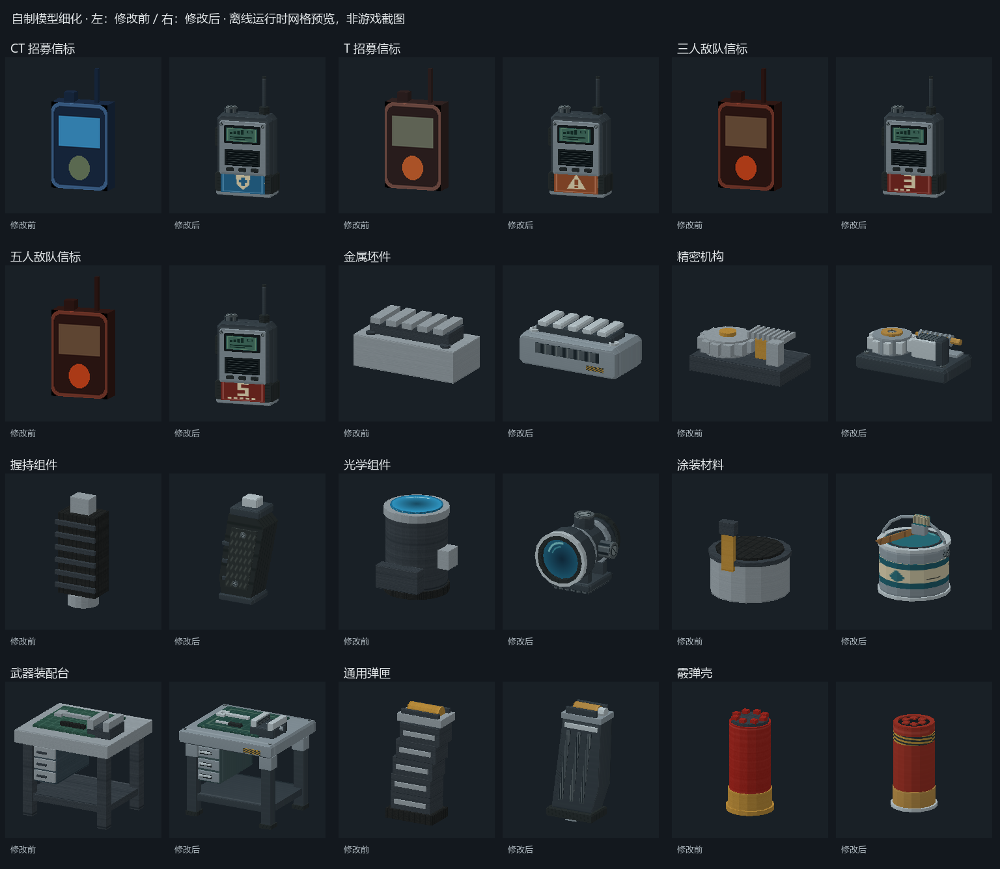

# 自制补给模型细化：2026-09-24 实施记录

基线 `bb93e50`。本次完成[规划第12节](gun-balance-plan-2026-09-24.md#12-自制模型美化参考-tacz-的机械层次与清晰轮廓)的红框物品和第二批工作台／弹药源码实现；35枪平衡、维修价格及手雷参数仍是原有提案，本次未实施这些玩法变更。

## 已实现的外观

- 无线电：倒角前后壳、电池底座、天线护套、旋钮、侧键、凹入屏幕、扬声器和背夹。主体保持枪灰，局部蓝盾／赭红三角区分CT与T，敌队信标为红底3／5数字加短杠。停用救援信标使用灰色叉标，仍不开放获取和功能。
- 金属坯件：倒角主体、分层导轨、带壁凹孔、加工侧槽与小警示标。
- 精密机构：托架、齿轮、滑块、黄铜导杆、短弹簧环和固定螺钉。
- 握持组件：倾斜轮廓、左右防滑侧片、指槽、连接榫、底盖和螺钉。
- 光学组件：横向短镜筒、凹入前后镜片、镜圈、安装环、调节鼓和导轨底座。
- 涂装材料：卷边漆罐、色带标签、可见漆面、提手及分材质刷子。
- 工作台：台板边缘、台脚护垫、抽屉缝／把手、台钳钳口／丝杆、工具和警示牌。保持原有碰撞数组。
- 通用弹匣改为连续曲线轮廓、供弹唇、底板和冲压槽；霰弹壳补底火、卷口与色带。

整体采用低多边形机械轮廓与清晰材质分区，不导入TaCZ资源，也不增加PBR或新着色器。细节纹理全部由 `tools/build_supply_surface.py` 的固定绘制指令生成，无外部图片和系统字体依赖。

## 前后对照与视觉检查



- [32／48／64像素图标，按实际分辨率渲染](supply-models-icons.png)
- [正面、背面、侧面、上方检查](supply-models-views.png)

图像来自实际C#运行时网格导出和对应贴图，使用独立OpenGL正交预览。前后采用相同镜头、比例和背景；工作台留足画幅，避免边缘裁切。旧无线电使用原始GLB和对应染色。上述图像都是离线检查，**不是游戏截图**，不覆盖游戏UI排版、手部接触、地形光照与手机性能。

已在预览迭代中修正信标数字压扁、圆柱每面重复贴图和工作台预览裁切。镜片是有色不透明面，不会引入透明排序；旧纹理随机噪点改成受控的材质线条。

## 实现与原计划的调整

八种补给及五种信标变体统一由 `ScSupplyGeometry` 构建，`ScSurvivalMesh.Build` 仍保留原来的公开入口与0～7意义，8～12仅为内部网格种类，**不是物品ID**。

无线电最终采用与补给共用的程序化网格和图集，取代原计划另生成一份GLB。原因是这里都是简单静态硬表面物品，统一构造能避免C#与Python各维护一份几何，同时复用已修复的背包网格／主线程纹理预载。Tactical仅按原物品data选择外观，绘制时不再全身染色；网格与图标在初始化时缓存，绘制不重建网格或逐格载入纹理。

原无线电GLB／PNG仍保留，旧 `build_tactical_items.py` 已注明其历史诊断用途。CS2维修包、拆弹器、枪械、刀具及其导入流程未重建。旧 `TacticalRenderCheck` 的radio分支仍查看历史GLB，不能拿它验证新版无线电；新版以 `SupplyModelCheck` 的真实绘制路径为准。

`build_survival_polish_assets.py` 的图集生成改为调用独立作者脚本；只改补给时直接运行新脚本，不需要CS2源目录或重导手雷粒子。保留 `ScSurvivalMesh.Preload`、地形线程只读纹理、背包独立网格及UI忽略场景暗色的既有保护。

## 几何和资源成本

| 对象 | 旧提交三角形（含退化面） | 新提交三角形 | 新单面几何三角形 | 新顶点 |
|---|---:|---:|---:|---:|
| 通用弹匣 | 648 | 608 | 304 | 912 |
| 霰弹壳 | 1152 | 1232 | 616 | 1848 |
| 金属坯件 | 552 | 1296 | 648 | 1944 |
| 精密机构 | 936 | 2184 | 1092 | 3276 |
| 握持组件 | 384 | 1064 | 532 | 1596 |
| 光学组件 | 1200 | 2368 | 1184 | 3552 |
| 武器装配台 | 480 | 2048 | 1024 | 3072 |
| 涂装材料 | 624 | 1928 | 964 | 2892 |
| 无线电，每个变体 | 36（旧GLB） | 1848 | 924 | 2772 |

新网格继续提交反向面，以保留台底与各观察方向的可见性；“单面几何”按提交数除2统计，包含零件之间被遮挡的面，不等同于每帧屏幕可见面数。新模型全部无退化三角形，顶点均远小于16位索引上限；单面几何均在规划候选预算内。无线电细化幅度最大，面数增加是真实成本，不能只用PNG更小声称性能更好。

共享图集由256×128扩大为512×256、25个有效格，每格保留3像素边缘扩色。RGBA未压缩基础纹理存储约128KiB→512KiB（不含驱动／mipmap开销）；无线电复用这张纹理。没有实测整机峰值显存与手机帧耗时，仍须设备验收。

## 验证结果

- Release构建成功，0警告、0错误；主构建使用 `-p:SkipScmodPackaging=true`。诊断项目的引用也强制跳过打包。
- 实际导出13套运行时网格；有限坐标、UV范围、有效索引、无退化三角形、预算、UI独立副本、工作台格内边界及补给第一人称摄像机间距检查通过。
- 52次原生CPU绘制组装通过：13种物品分别按世界→背包→世界→背包顺序绘制，场景光强设0、输入深色；背包顶点仍保持正常颜色与不透明度，既有data正确选择招募／挑战模型。此项使用不提交GPU的纹理占位对象，不能冒称GPU上传验证。
- 三人／五人信标几何一致且标识UV不同；重复初始化无缓存重复添加异常。
- 已有17项 `ScPolishSelfTest` 自测通过。同步更新包检查中的无线电准备步骤，在保留旧GLB资源检查的同时准备新缓存；包检查工具本身构建通过，完整包内检查仍待实际打包后运行。
- 作者图集重建两次字节一致，RGBA透明度全部255；保护资源与 `bb93e50` 相同。检查数值证据的35枪／210等级行、120维修报价、手雷公式及35个已安装Mod校验值仍通过。
- 完整证据见 [JSON](supply-models-2026-09-24-evidence.json)。未跑整套包内PackageCheck，因为这次验证的是未打包源码构建。

本次没有制作可交付安装包、安装Mod或运行玩家世界。最初基线探针的PowerShell参数转发未正确保留跳过打包参数，触发了项目默认的中间scmod输出；该中间文件未交付或安装。后续均使用带引号的显式参数，并在诊断项目引用中增加跳过打包保护。实际游戏还需确认：背包各缩放、手持／掉落接触、放置工作台后重读档的纹理，以及手机同场景帧耗时。

## 复现

在仓库根目录运行（PowerShell的冒号参数需保留引号）：

```powershell
./tools/dev.ps1 python tools/build_supply_surface.py
./tools/dev.ps1 dotnet build tools/SupplyModelCheck -c Release '-p:SkipScmodPackaging=true'
./tools/dev.ps1 dotnet tools/SupplyModelCheck/bin/Release/net10.0/SupplyModelCheck.dll .tmp/supply-review/after verify
./tools/dev.ps1 python tools/render_supply_review.py --before .tmp/supply-refine-20260924/before --after .tmp/supply-review/after --atlas src/ScCsgoKnives/Assets/Textures/ScCsgoKnives/survival_surface.png --out .tmp/supply-review/render
```

最后一条需要本机已保存的修改前网格、图集与无线电GLB／PNG；这些位于 `.tmp`，不随Git传输。其他机器可在独立的 `bb93e50` 检出中加入诊断导出器、用 `baseline` 模式重建该输入；不能把修改后的源码用baseline参数运行就冒充旧版。已提交的PNG及前后几何统计随Git传输。

后续发布需同时提供匹配的core、tactical和新图集资源包，并更新发布版本／依赖：新版tactical调用core的8～12号网格，旧core不认识这些种类。当前未改发布元数据，不允许把单独tactical DLL或旧资源包混装成正式交付。物品ID、v5／schema6、配方、伤害、射速、材料、存档和第三方Mods均未变更。
